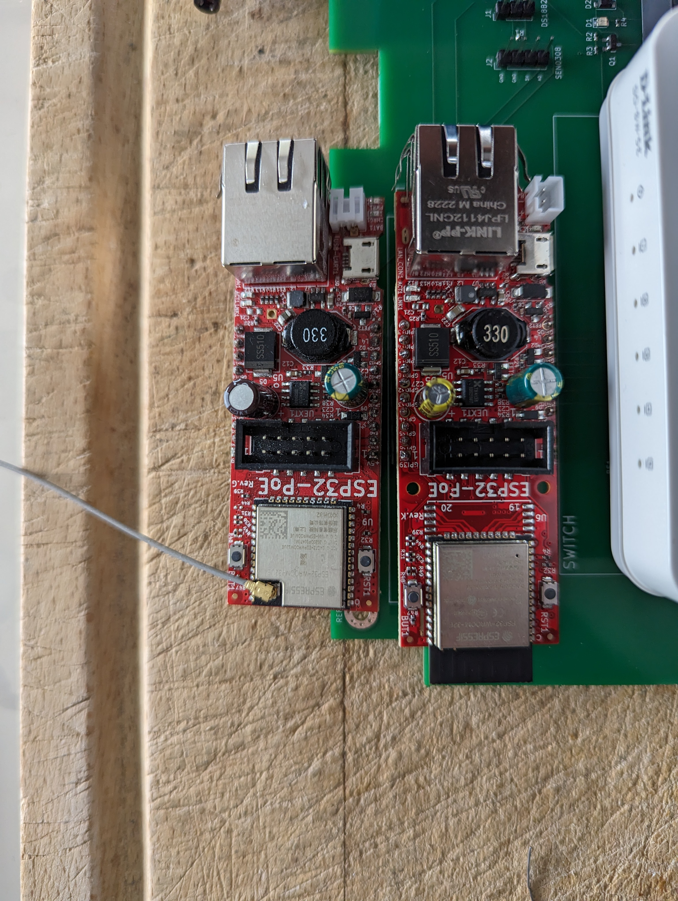

# mylife-home-devices
MyLife Home devices

- [ePanel IO](epanel-io/README.md) :white_check_mark: Module de tableau électrique pour interconnecter E/S avec domotique (rpi/esp)
- [ePanel Energy Monitor](epanel-energy-monitor/README.md) :white_check_mark: Module de tableau électrique pour mesurer la consommation électrique
- [ePanel Controller](epanel-controller/README.md) :white_check_mark: Module de tableau électrique pour contrôler IO et Energy Monitor
- [Garden box](garden-box/README.md) :white_check_mark: Boîtier de commandes/capteurs dans le jardin
- [RGB garden box](rgb-garden-box/README.md) :white_check_mark: Boîtier de commande spots RGB dans le jardin
- [RGB spot 10W](rgb-spot-10w/README.md) :white_check_mark: Reprise de spots existant infrarouge pour connexion direct cables RGB
- [Bed Smart Plug](bed-smart-plug/README.md) :question: "Multiprise intelligente" pour mettre en tête de lit
- [Presence Wifi sensor](presence-wifi-sensor/README.md) :question: Détecteur de présence Wifi
- RGB indoor box :question: Boîtier de commande spots/ruban leds RGB en intérieur
- [Garage door driver](garage-door-driver/README.md) :question: Pilote de porte de garage
- Kitchen hood driver :question: Pilote de hôte
- Pergola driver :question: Pilote de pergola (ZETA 868 ?)

## Notes
- Tutorial KiCad: https://www.youtube.com/playlist?list=PLuQznwVAhY2WA4CIf3_aB_e8hRCSbQuUp
- Best practice routing PCB: https://resources.altium.com/fr/p/top-5-pcb-design-guidelines-every-pcb-designer-needs-know
- Kicad to JLCPCB
  - https://support.jlcpcb.com/article/149-how-to-generate-gerber-and-drill-files-in-kicad
  - https://support.jlcpcb.com/article/84-how-to-generate-the-bom-and-centroid-file-from-kicad
  - plugin pour aide a la generation de commande : https://github.com/Bouni/kicad-jlcpcb-tools
  - plugin pour importer les composants JLCPCB dans Kicad : https://github.com/TousstNicolas/JLC2KiCad_lib
- Component footprints : https://componentsearchengine.com/
- ESP32-POE:
  - NE PAS utiliser GPIO0 si possible (ne pas le mettre DOWN au boot)
  - Attention : Version avec antenne interne est plus grande (pas que l'ESP, toute la board). Le footprint Kicad courant correspond à la version avec antenne externe : 

