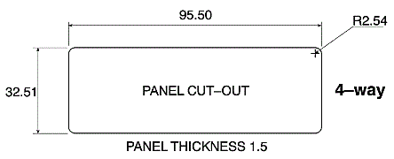
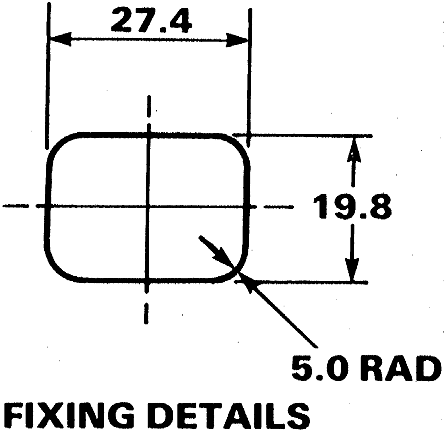
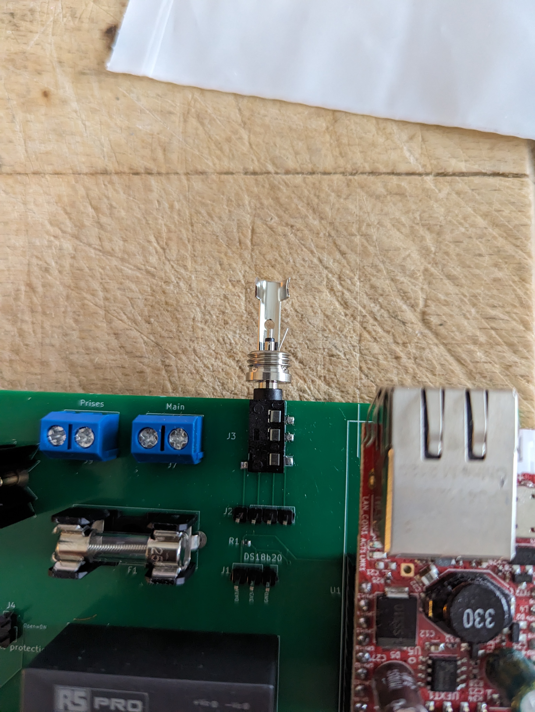
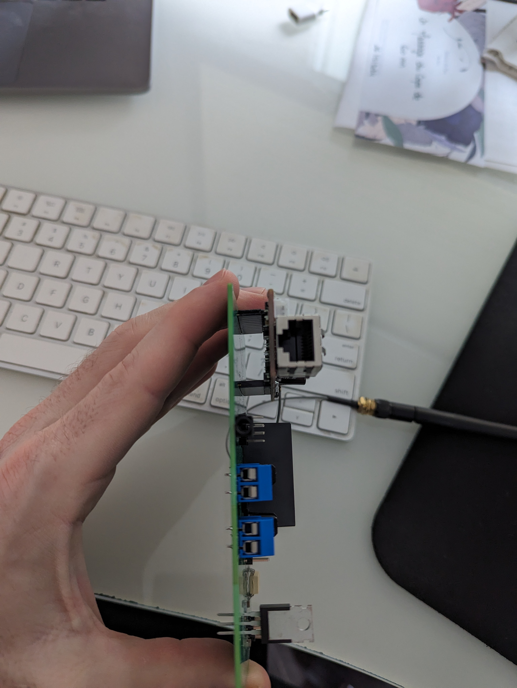
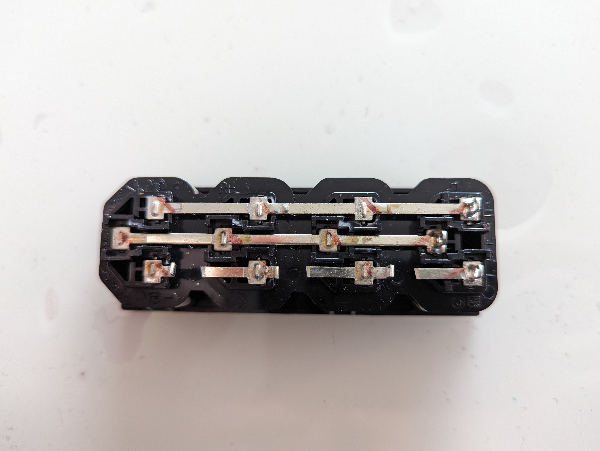
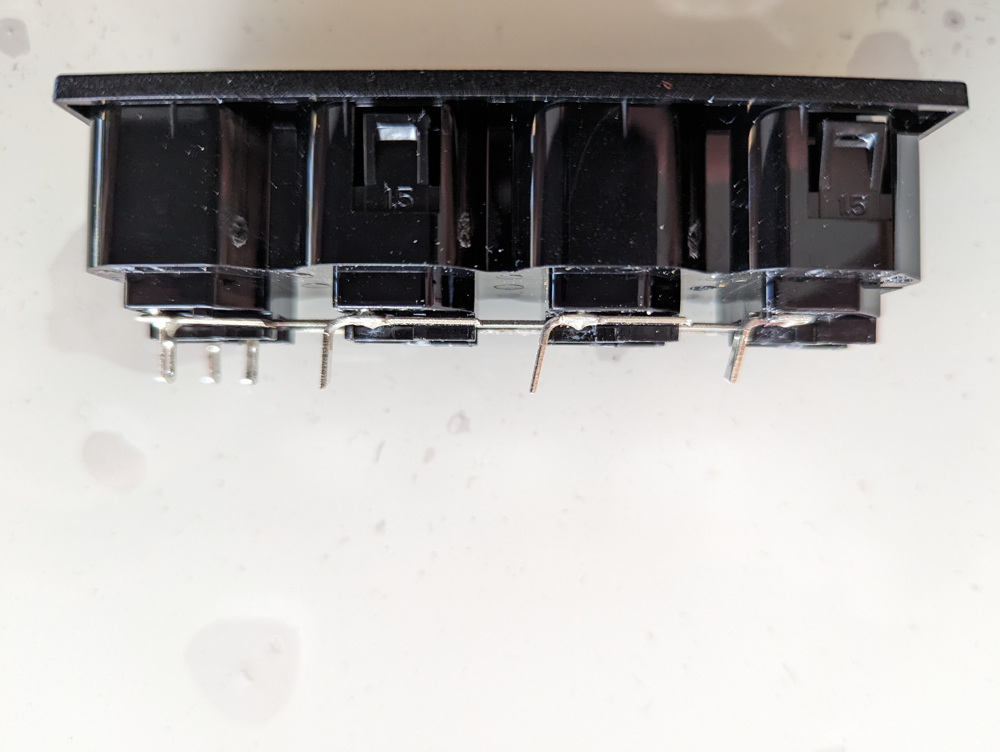
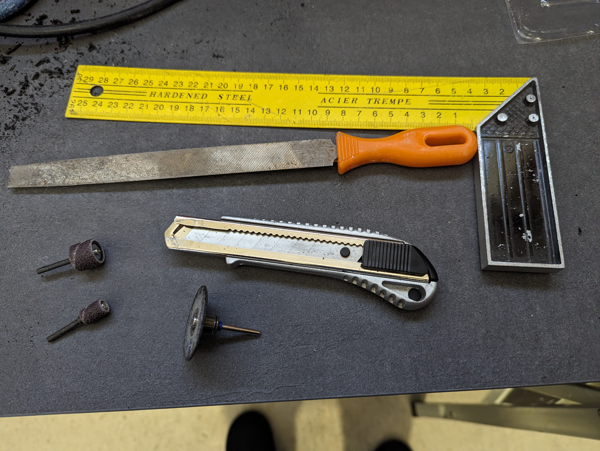
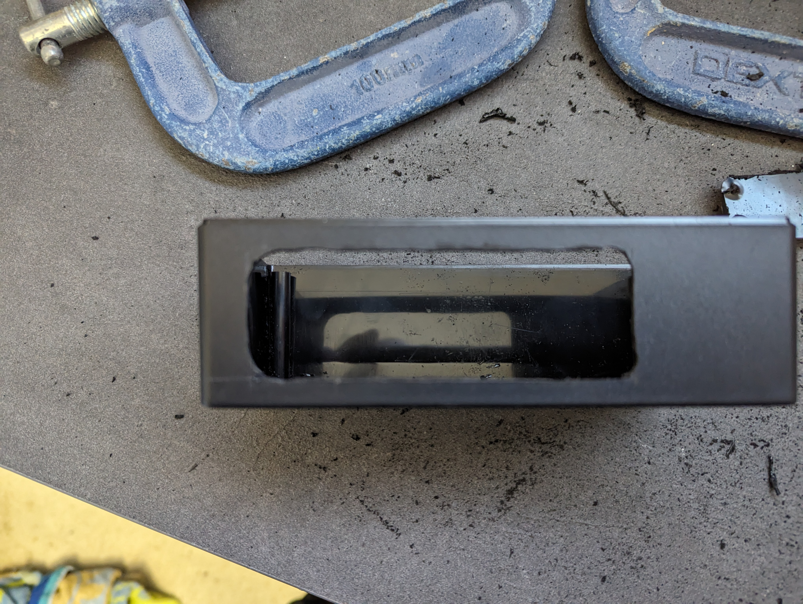
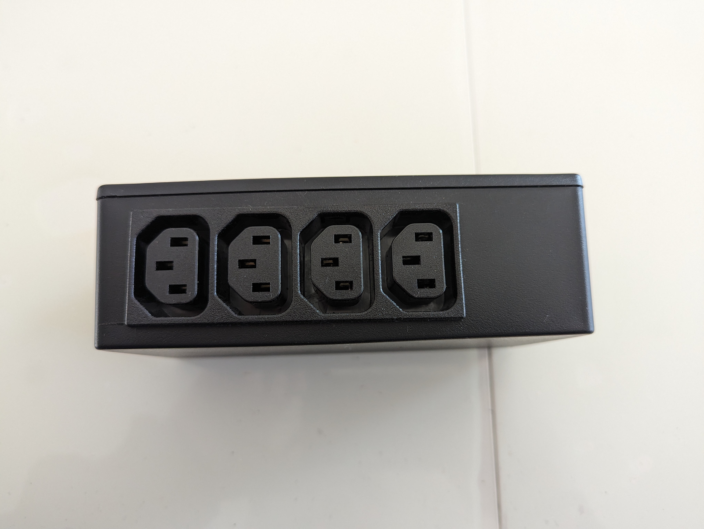
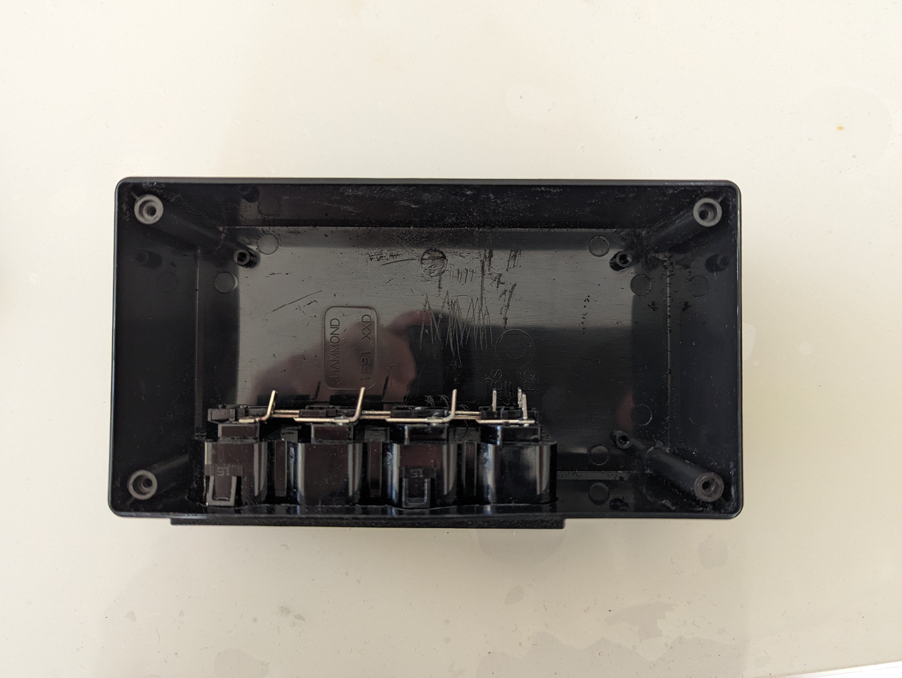

# Bed Smart Plug

## Besoin

- Récepteur 433mhz (pour télécommande)
- Capteur température
- 4 sorties prises entre 5W et 200W
- Wifi et Ethernet
- Boitier :
  - peut etre relativement large/long, mais plat
  - avec les prises sur un côté
  - comme un switch
  - comme ca on peut le mettre sous un meuble, ou derriere un meuble debout

### Emplacements

- chambre parents
- chambre Eléonore
- chambre Éloïse
- chambre d'amis ?
- rdc derrière TV ?
- bibliothèque pour lampe pot de fleurs + température ?

## Choix techniques

- ESP32 ethernet ou wifi
  - prévoir des trous sur le PCB pour fixer l'esp avec un serre flex entre son header et son module ESP, sur l'inscription "ESP32-PoE"
- SSR pour éviter claquement relais
  - BT136 (4A max)
  - Dissipateurs
  - Fusible 5x20 à souder
- Entree Prise alim IEC C14
- Sorties prises IEC C13 pour avoir un format plus compact
- Capteur température :
  - DS18b20
  - avec Jack
  - possible souder jack a la main sinon
  - capteur integré inutile (mesure la temperature de l'esp/des triac pas de la piece)
- Télécommande 433MHz:
  - Renkforce 1208459
  - https://amzn.eu/d/fGBrWJP
  - https://www.conrad.fr/fr/p/renkforce-1208459-sans-fil-telecommande-interieure-1208459.html

## Design

- Board : ESP32-POE https://www.olimex.com/Products/IoT/ESP32/ESP32-POE/open-source-hardware
- Alim 220v -> 5V 1A : https://fr.rs-online.com/web/p/alimentations-a-decoupage/1812200
- Jack DS18B20 :
  - https://www.amazon.fr/dp/B075FYYLLV/
  - https://fr.rs-online.com/web/p/connecteurs-jacks/5051299
- Récepteur 433MHz : (modulation ASK)
  - ~~ AM-RX12A-433P https://fr.farnell.com/rf-solutions/am-rx12a-433p/recepteur-module-rf-433-92-110dbm/dp/2759279 ~~ (frais de gestion trop chers)
  - QAM-RX10-433 https://fr.rs-online.com/web/p/modules-rf/1258208
  - pinout compatible
  - normalement 5V, tester en broadboard avec alim 5V + pont diviseur sur les data pour passer a 3.3V
- Triac : BT136-600E https://fr.rs-online.com/web/p/triac/7271120
  - ~~ Dissipateur https://fr.rs-online.com/web/p/dissipateurs-de-chaleur/1898101/ ~~
  - moins haut, même base : https://fr.rs-online.com/web/p/dissipateurs-de-chaleur/1898094
  - vis M3 : même que garden box : https://fr.rs-online.com/web/p/vis-a-rondelle-indesserrable/0279149
  - écrous M3 : https://fr.rs-online.com/web/p/ecrous-hexagonaux/0560293
- Porte fusible : https://fr.rs-online.com/web/p/porte-fusibles/1769047
  - Fusible : https://fr.rs-online.com/web/p/fusibles-cartouches/6686007
- Boitier :
  - https://fr.rs-online.com/web/p/boitiers-pour-usage-general/8180494
    - noir comme les connecteurs C13/C14
    - les facades laterales sont d'un seul tenant: le couvercle est "plat", plus facile pour percer les facades.
  - Vis de fixation PCB : https://fr.rs-online.com/web/p/vis-autotaraudeuses/4831202
- Prises :
  - entree C14 : https://fr.rs-online.com/web/p/connecteurs-iec/8117207
  - sortie C13 : https://fr.rs-online.com/web/p/connecteurs-iec/8117193
  - sortie C13 x 4 à clip : https://fr.rs-online.com/web/p/connecteurs-iec/2318101
    - dessouder une barre ou la couper (phase), laisser les 2 autres
    - montage :
    
    

  - entrée C13 à clip : https://fr.rs-online.com/web/p/connecteurs-iec/0481623
    - montage :
    
    

  - ~~ 1 entrée 4 sorties : https://fr.rs-online.com/web/p/connecteurs-iec/3135474 ~~
    - semble indisponible

## Observations Prototype-1 epanel-io

- cf [epanel-io/README.md#observations](../epanel-io/README.md#observations) - Triac
- si on enleve snubber du phototriac, toujours une fuite (couper la piste entre C3 et C4)
- si on enleve les 2 snubbers, plus de fuite, spot led 10w reste eteint (couper la piste entre C3 et le triac)

## Prototype-1

### Objectifs

- Triac: 
  - dissipateurs
  - snubbers/bruit/fuite
    - spot 10w
    - guirlande boules
    - lampe bureau
    - lampe chevet
    - alim a decoupage
- 433MHz receiver
  - binding avec telecommandes
- ds18b20
  - jack pinout: voir quelles broches sur chaque prise matchent + selectionner le pinout qu'on veut.
- fusibles

### Schematic

- [Schematic](prototype-1/schematic.png)

### Pinout

- GPIO02 : Triac
- GPIO13 : DS18B20
- GPIO36 : Récepteur 433MHz

### Observations

- Dissipateur :
  - Rapprocher dissipateur et triac de 0.5 - 1 mm
  - Fixation dissipateur/triac : écrou M3 + reprendre vis M3 anti-deserrage garden-box
- Fusibles : OK
- Triac :
  - spot 10w :
    - triac snubber => fuite (KO)
    - opto snubber => fuite (KO)
    - sans snubber => pas de bruit (OK)
  - Perceuse à colonne :
    - puissance : 1.6A au démarrage puis 0.8
    - Avec/Sans snubber : pas de bruit mais la perceuse fait elle du bruit
    - apres 5 mins dissipateur + triac froids 
  - Lampe chevet Éloïse
    - puissance : 26.5ma
    - Avec snubber : KO bruit quand off
    - Sans snubber : OK sans bruit
  - Guirlande Éloïse
    - Avec snubber : KO clignote
    - Sans snubber : OK sans bruit
    - puissance très instable semble avec des pics a 600ma puis revient a 0ma (problème multimètre ?)
  - Lampe bureau
    - puissance semble 25ma (problème multimètre ?)
    - Avec snubber : KO bruit quand off
    - Sans snubber : OK sans bruit
  - Lampe chevet Eléonore
    - puissance 1.5a???? (problème multimètre ?) -> Ampoule à incandescence 40W
    - Avec snubber : OK sans bruit
    - Sans snubber : OK sans bruit
- Prise jack 
  
  
  
  (de gauche à droite) 
  - 1 : corps
  - 2 : pin penché 
  - 3 : base pin central
  - 4 : extrémité pin central

  Attention : bien enfoncer la prise
  - On peut mettre la prise sous l'ESP

  

- Récepteur 433mhz
  - Les 2 pins data sont reliés ensemble 
  - Connecter au 5V, et mettre un point diviseur :
    - R1 = 10k (entre output recepteur et input ESP)
    - R2 = 2x 10k en série (entre input ESP et GND)
  - Config dump : 
```yaml
    remote_receiver:
      pin: GPIO36
      dump:
      - rc_switch
      tolerance: 50%
      filter: 250us
      idle: 4ms
      buffer_size: 2kb
```
  - Valeurs (le repeat est très rapproché) : 
    - `Received RCSwitch Raw: protocol=1 data='...'`
  
  _Config télécommande grise : 1 = ON, 5 = ON_
  
| Action | code télécommande | code ABCD | ?? | on/off |
|---|---|---|---|---|
| A on   | 00 01 01 01 00 | 00 01 01 01 | 01 | 00 01 |
| A off  | 00 01 01 01 00 | 00 01 01 01 | 01 | 01 00 |
| B on   | 00 01 01 01 00 | 01 00 01 01 | 01 | 00 01 |
| B off  | 00 01 01 01 00 | 01 00 01 01 | 01 | 01 00 |
| C on   | 00 01 01 01 00 | 01 01 00 01 | 01 | 00 01 |
| C off  | 00 01 01 01 00 | 01 01 00 01 | 01 | 01 00 |
| D on   | 00 01 01 01 00 | 01 01 01 00 | 01 | 00 01 |
| D off  | 00 01 01 01 00 | 01 01 01 00 | 01 | 01 00 |

  _Config télécommande grise : 1 = ON, 2 = ON_

  => Code télécommande : `00 00 01 01 01`, le reste semble correspondre

  - Avec récepteur dans salon :
    - Fontionne depuis CH1
    - Fonctionne depuis CHP

## Prototype-2

### Objectifs

- boitier 
- sortie RJ45
- sortie prise jack
- fixations C13/C14
- tester nouveau dissipateur

### Observations

- Dissipateur + écrou de fixation OK
- Boîtier :
  - pas assez long (on ne peut pas mettre toutes les prises + ESP)
  - pas assez large (ESP ne tient pas en largeur)
  - hauteur OK mais prise C14 avec vis sur les côtés ne tient pas en hauteur : voir pour prendre une encastrable comme la multiprise C13
  - aluminium pour ne pas se déformer avec les trous ?
  - aérations ?
  - **aluminium trop cher, autres boitiers mauvaise taille. On garde celui là mais en mettant l'alime/jack/rj45 sur un côté**
- Multiprise C13 x4 : séparation des phases OK

  
  

- Perçage boitier pour multiprise C13x4
  - Tracer au cutter + règle métallique
  - Le gros :
    - Découpage disque Dremel vitesse 5 + coins avec perceuse a colonne plus gros forêt placo (faire coins en premier)
  - la finition :
    - tubes ponceuse Dremel, vitesse 2.5
    - gros tube pour partie plate + coins arrondis
    - petit tube pour coin moins arrondis (cf forme des prises)
    - lime pour égaliser
  - Passage des clips (le boitier est trop épais)
    - Entamer l'épaisseur avec gros tube
    - Installation de la prise : pousser les clips vers l'extérieur depuis l'intérieur des prises

  
  
  
  

  - Tests:
    - branchement/debranchement prise OK
    - on peut manoeuvrer les clips depuis l'intérieur des prises pour démonter la multiprise après installation
    - vue de haut, empreinte des prises sur le CI = 110x30
- Vis de fixation PCB OK

## Proto 3

### Objectifs

- Taille CI dans boitier
- Emplacement ESP32 pour sortie RJ45
- Emplacement Jack pour sortie boitier -> elle doit passer sous RJ45
- Est-ce que le PCB peut passer sous les prises ?
  -> oui sous prise alim (plus petite que sorties)
  -> essayer de mettre prise alim a côté de prises sorties
  -> faire un PCB qui ne passe pas sous prises sorties (inutile)

Abandonné car gros cher vs V1

Prix proto : 
- build : 19.20
- total : ~45eur

Prix v1 :
- build : 43.06
- total : ~70eur

## V1

- Pinout jack :
  - VCC au bout => 4
  - GND sur le corps => 1
  - DATA 2 milieux reliés ensemble => 2-3
- Fusible devrait tenir
- Borniers OK en hauteur, on verra s'ils tiennent car ils sont gros sinon il faudra en mettre des plus petits

## Notes

- Schémas
  - **https://innovatorsguru.com/switching-ac-load-using-triac/**
  - https://www.sonelec-musique.com/electronique_realisations_interfaces_230v_001.html
  - http://www.sper.hr/eng/solid_state_relay_scheme.htm
  - https://fr.rs-online.com/web/p/triac/7142577
  - http://wiring.org.co/learning/basics/lightbulb.html
  - https://www.sonelec-musique.com/electronique_realisations_relais_statique_001.html
  - https://electronics.stackexchange.com/questions/531528/relay-circuit-with-moc3021-and-bt136
  - https://electronics.stackexchange.com/questions/488518/triac-switch-circuit-using-moc3021-and-bt136
  - http://www.farnell.com/datasheets/97984.pdf (fig. 8)
  - Attention a garder le port USB accessible
- triacs
  - comparaison specs : https://www.esr.co.uk/components/products/frame-triacs.htm
- boitier à imprimer
  - fusion 360
  - https://www.thingiverse.com/thing:3700953 (esp32-poe box case, pour la taille + le socket)
  - https://www.printables.com/model/476196-esp32poe-box-v12 (esp-poe box case, pour le maintien du boitier + la taille + le socket)
  - https://www.thingiverse.com/thing:410003 (rapsberry-pi box case, pour les vis + inspiration)
