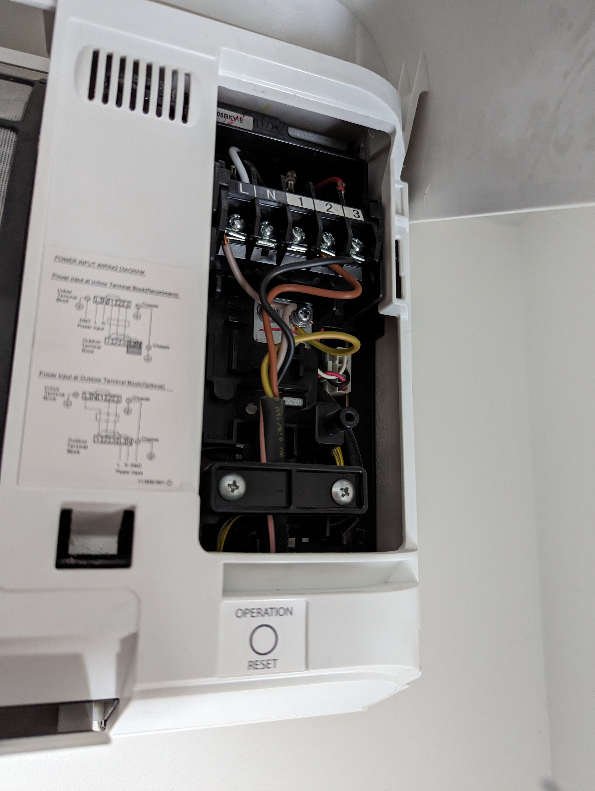

# Clim driver

## Besoin

- Wifi
- doit tenir dans le boitier de clim directement
- alimenté par la clim
- le plus de contrôle possible
- ajouter un capteur de température

### Info clim

- RDC: Toshiba air conditioner RAS-13BKV-E1
- R1: 4x Toshiba air conditioner RAS-05BKV-E
- place derriere capot : 70x15x25

## Design

- IR send/recv :
  - https://www.wemos.cc/en/latest/_static/files/sch_ir_v1.0.0.pdf
  - https://www.wemos.cc/en/latest/d1_mini_shield/ir.html
- Temp : DS18B20U SMT :
  - https://jlcpcb.com/partdetail/94441-DS18B20U_TR/C93246