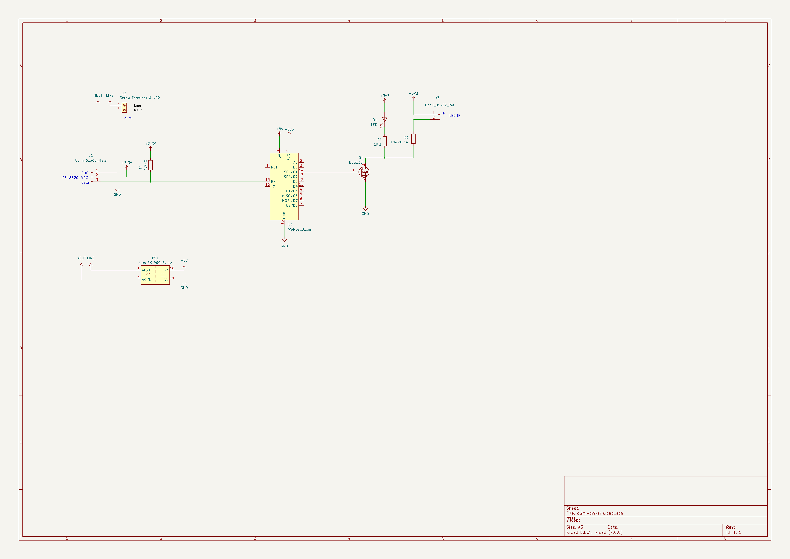

# Clim driver

## Besoin

- Wifi
- doit tenir dans le boitier de clim directement
- alimenté par la clim
- le plus de contrôle possible
- ajouter un capteur de température

### Info clim

- RDC: Toshiba air conditioner RAS-13BKV-E1
- R1: 4x Toshiba air conditioner RAS-05BKV-E
- place derriere capot : 70x15x25
- place pompe relevage :
  - https://www.manomano.fr/p/pompe-relevage-climatisation-mini-orange-230v-aspen-3124579
  - 39x34x80, prévoir sortie cable dans facade 39x34

## Design

- IR send/recv :
  - https://www.wemos.cc/en/latest/_static/files/sch_ir_v1.0.0.pdf
  - https://www.wemos.cc/en/latest/d1_mini_shield/ir.html
  - Led IR: https://fr.rs-online.com/web/p/leds-infrarouges/6997708
  - 18ohm @ 3.3v
- Temp : DS18B2 :
  - en dehors du boitier sinon la temp sera faussée avec la chaleur de l'ESP8266
- Wemos D1 mini :
  - https://www.amazon.fr/dp/B093G72SHN
  - 34x26
- Alim :
  - alim 220v -> 5V 1A : https://fr.rs-online.com/web/p/alimentations-a-decoupage/1812200
  - 37 x 24.5 x 18
  - apparemment il n'existe pas plus petit
- Boitier :
  - https://fr.rs-online.com/web/p/boitiers-pour-usage-general/9190373

## V1

### Wiring

### 3D view

### Main

### Images
