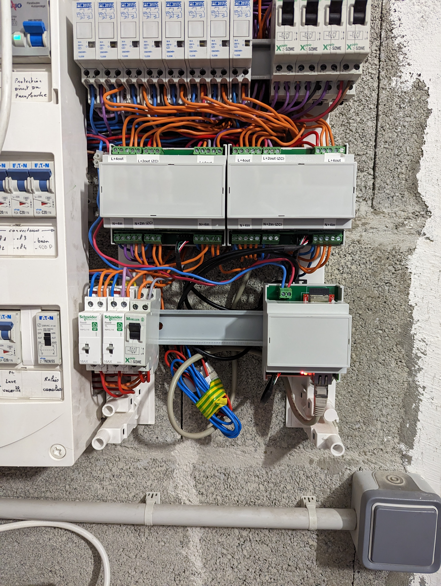
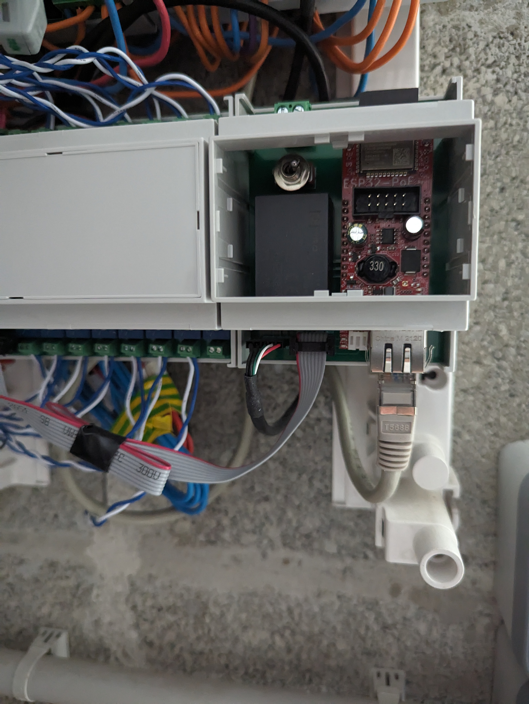

# ePanel Controller

## Besoin

- piloter IO (i2c, alim 5V)
- piloter Energy Monitor (SPI avec 2 CS + TIC, alim 3V3)

## Choix techniques

- ESP32 : ESP32-POE https://www.olimex.com/Products/IoT/ESP32/ESP32-POE/open-source-hardware
- switch on/off en série de l'alim pour faciliter le debug USB/hard reset

## Design

### Matériel

- Boitier : https://fr.rs-online.com/web/p/boitiers-rail-din/7495824
- Switch : https://fr.rs-online.com/web/p/interrupteurs-a-levier/0401703
- Alim 220v -> 5V 1A : https://fr.rs-online.com/web/p/alimentations-a-decoupage/1812200
- Bornier : https://fr.rs-online.com/web/p/borniers-pour-circuits-imprimes/1444286

## V1

### 3D view


### Main


### Images




## Debug UART

_GPIO3 est utilisé par l'UART_

- Reflasher config ESP :
  - interrupt pin GPIO16 (inutilisé). Cela rend les inputs inutilisables.
  - base.yaml: logger -> baud_rate: 115200
- Débrancher la connexion vers picos, et relier avec des dupont tous les pin sauf celui du milieu (interrupt pin)
- Brancher micro usb low profile sur l'ESP

### Logs

2024.03.18 - plantage au boot

```
E (26932) task_wdt: Task watchdog got triggered. The following tasks did not reset the watchdog in time:
E (26932) task_wdt:  - loopTask (CPU 1)
E (26932) task_wdt: Tasks currently running:
E (26932) task_wdt: CPU 0: IDLE
E (26932) task_wdt: CPU 1: IDLE
E (26932) task_wdt: Aborting.

abort() was called at PC 0x400f78f0 on core 0


Backtrace:0x40083ba5:0x3ffbe8ac |<-CORRUPTED


ELF file SHA256: 0000000000000000

Rebooting...
ets Jul 29 2019 12:21:46

rst:0xc (SW_CPU_RESET),boot:0x13 (SPI_FAST_FLASH_BOOT)
configsip: 0, SPIWP:0xee
clk_drv:0x00,q_drv:0x00,d_drv:0x00,cs0_drv:0x00,hd_drv:0x00,wp_drv:0x00
mode:DIO, clock div:2
load:0x3fff0018,len:4
load:0x3fff001c,len:1044
load:0x40078000,len:10124
load:0x40080400,len:5828
entry 0x400806a8
```

2024.03.18 - plantage quand trop d'ordres

```
E (108994) task_wdt: Task watchdog got triggered. The following tasks did not reset the watchdog in time:
E (108994) task_wdt:  - async_tcp (CPU 1)
E (108994) task_wdt: Tasks currently running:
E (108994) task_wdt: CPU 0: IDLE
E (108994) task_wdt: CPU 1: IDLE
E (108994) task_wdt: Aborting.

abort() was called at PC 0x400f78f0 on core 0


Backtrace:0x40083ba5:0x3ffbe8ac |<-CORRUPTED


ELF file SHA256: 0000000000000000

Rebooting...
ets Jul 29 2019 12:21:46

rst:0xc (SW_CPU_RESET),boot:0x13 (SPI_FAST_FLASH_BOOT)
configsip: 0, SPIWP:0xee
clk_drv:0x00,q_drv:0x00,d_drv:0x00,cs0_drv:0x00,hd_drv:0x00,wp_drv:0x00
mode:DIO, clock div:2
load:0x3fff0018,len:4
load:0x3fff001c,len:1044
load:0x40078000,len:10124
load:0x40080400,len:5828
entry 0x400806a8
```

## Notes

- Alimentation : 
  - rpi pico: < 100ma
  - esp32 poe: 200ma
  - mcp3208: 0.4ma
  - alim 220v -> 5V 1A : https://fr.rs-online.com/web/p/alimentations-a-decoupage/1812200
- mettre un switch pour couper l'alimentation, permet de hard-reboot en cas de plantage
  - on peut aussi rajouter une led d'état https://esphome.io/components/status_led.html
  - a voir comment implanter ca dans le couvercle du boitier DIN
  - switch a levier au milieu du boitier 
    - aucune fausse manip ne va le bouger tout seul dans le boitier
    - on peut reset en ouvrant uniquement le couvercle du boitier sans ouvrir le tableau
    - https://fr.rs-online.com/web/p/interrupteurs-a-levier/0401703
