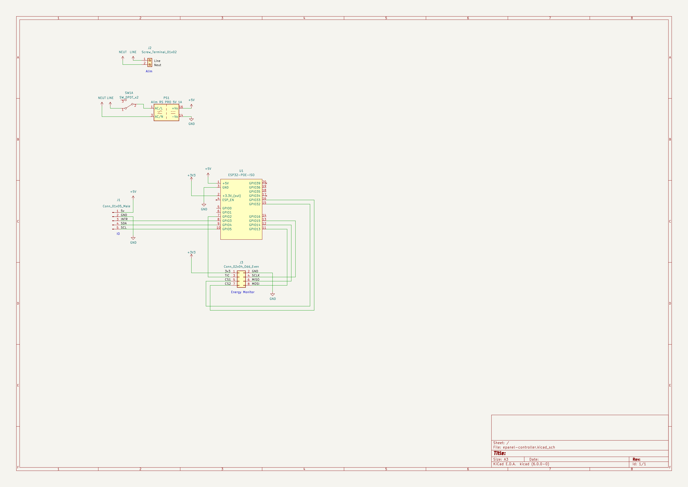

# ePanel Controller

## Besoin

- piloter IO (i2c, alim 5V)
- piloter Energy Monitor (SPI avec 2 CS + TIC, alim 3V3)

## Choix techniques

- ESP32 : ESP32-POE https://www.olimex.com/Products/IoT/ESP32/ESP32-POE/open-source-hardware
- switch on/off en série de l'alim pour faciliter le debug USB/hard reset

## Design

### Matériel

- switch : https://fr.rs-online.com/web/p/interrupteurs-a-levier/0401703
- alim 220v -> 5V 1A : https://fr.rs-online.com/web/p/alimentations-a-decoupage/1812200

## V1

### TODO

- ESP sur CNMB/4 avec Alim + IO I2C/SPI

## Notes

- Alimentation : 
  - rpi pico: < 100ma
  - esp32 poe: 200ma
  - mcp3208: 0.4ma
  - alim 220v -> 5V 1A : https://fr.rs-online.com/web/p/alimentations-a-decoupage/1812200
- mettre un switch pour couper l'alimentation, permet de hard-reboot en cas de plantage
  - on peut aussi rajouter une led d'état https://esphome.io/components/status_led.html
  - a voir comment implanter ca dans le couvercle du boitier DIN
  - switch a levier au milieu du boitier 
    - aucune fausse manip ne va le bouger tout seul dans le boitier
    - on peut reset en ouvrant uniquement le couvercle du boitier sans ouvrir le tableau
    - https://fr.rs-online.com/web/p/interrupteurs-a-levier/0401703
