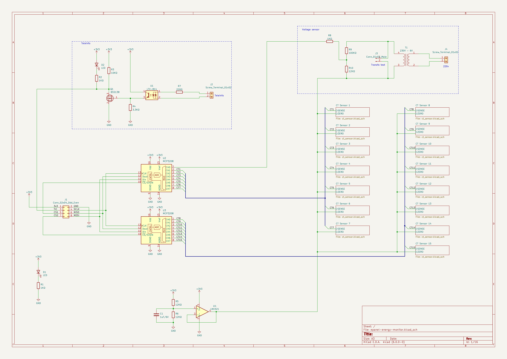
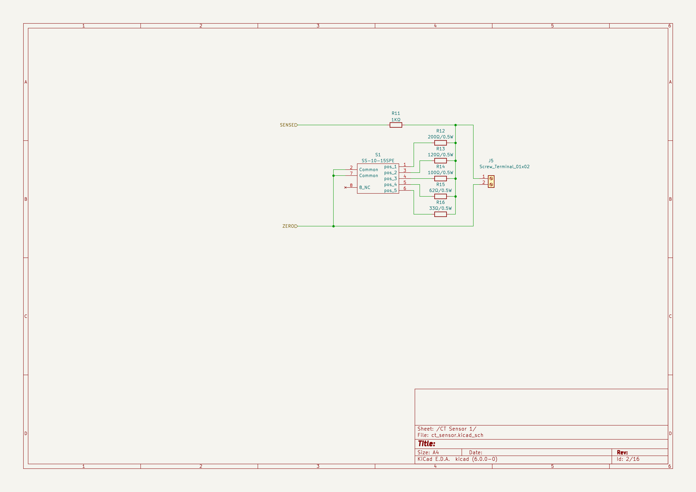

# ePanel Energy Monitor

## Besoin

- 12 capteurs
  - abonnement 12KVA ~ 55A
  - 4 sur inter diff (entre 40A et 63A)
  - 8 sur disjoncteurs (entre 10A et 32A)
- teleinfo

## Design

- MCP3208 x2
- déplacer ESP dans un boitier DIN a part

### Matériel

- Boîtier : 
  - https://fr.rs-online.com/web/p/boitiers-rail-din/7495837
  - https://fr.farnell.com/camdenboss/cnmb-6-kit/boitier-rail-din-m6/dp/3954259
- Borniers :
  - Petits : https://fr.rs-online.com/web/p/borniers-pour-circuits-imprimes/7901098
  - Grands : https://fr.rs-online.com/web/p/borniers-pour-circuits-imprimes/1444286
- Selecteurs : 
  - https://fr.rs-online.com/web/p/interrupteurs-dip-de-codage-rotatif/1796751
  - https://fr.farnell.com/nidec-copal/ss-10-15spe/commut-rotatif-sp5t-0-1a-5vdc/dp/2854806
- Câble 2x4 : https://www.amazon.fr/sourcing-map-Connecteur-Broche-Femelle/dp/B07H26VF1J
- Transfo : https://fr.rs-online.com/web/p/transformateurs-pour-circuits-imprimes/7320525

## V1

### Réglages

- pos1 = 200Ω = 10A
- pos2 = 120Ω = 16A
- pos3 = 100Ω = 20A
- pos4 =  62Ω = 32A
- pos5 =  33Ω = 60A

### 3D view


### Main



### CT Sensor



### TODO

- OK LTV-814 : mauvais footprint, le bon est plus "écarté", cf jlcpcb/parts
- OK BSS138: mauvais pinout/footprint, cf jlcpcb/parts
- OK borniers pour CT plus petits (2.54 ecartement) -> https://fr.rs-online.com/web/p/borniers-pour-circuits-imprimes/7901098
- OK transfo: pastilles bien placées mais trop petites
- OK transfo: ajouter des pin headers sur secondaire pour facilement pouvoir mesurer la tension au voltmetre
- OK Au lieu de jumpers pour config resistances, mettre un commutateur rotatif :
  - https://fr.rs-online.com/web/p/interrupteurs-dip-de-codage-rotatif/1796751
  - https://fr.farnell.com/nidec-copal/ss-10-15spe/commut-rotatif-sp5t-0-1a-5vdc/dp/2854806
- Note: Boitier DIN : Largeur espace pour bornier : 1.3cm
- OK ajouter une led pour montrer qu'il est bien alimenté

## Prototype-1


### Tests

### Observations

- Teleinfo
  - mauvais composant pour optocoupleur :
    - courant LTV-8141
    - correct: LTV-814 (C125118)
  - voir si on doit mettre une résistance de 4.7K, 1.2K ou 1K
- CT Clamp
  - les prises jack a souder sont très peu épaisses, elles doivent être au board du PCB ou changer de modèle
  - test avec aspirateur:
    - Théoriquement: 1300W /230V = 5.6A
    - Mesure avec ampèremètre sur directement sur le courant secteur : 6.12A
    - Mesure avec voltmètre aux bornes du burden resistor 120ohm : 0.31V /120Rb *2000 = 5.16A
    - Mesure avec oem_clamp recodé : 7.55A à l'allumage puis 6.35A après (instable). Note : le 0 est à 0.06A

### A faire pour proto 2:

- TIC
  - LTV-814
  - plusieurs choix de résistances pour TIC : 1k, 1.2k, 2k, 3.3k, 4.7k
  - mettre des pins headers pour pouvoir mesurer a l'oscillo si problème
- CT Clamp
  - mettre un MCP3208
  - jumper pour passer soit par MCP3208 soit direct sur ESP32
  - attention: GPIO2 et GPIO4 ne semble pas etre valides pour ADC avec esphome. GPIO32 et GPIO33 oui
  - mettre des pins headers pour pouvoir mesurer au voltmètre
  - plusieurs burden possibles:
    - 10A 233ohm -> 220 (10.6A)
    - 16A 146ohm -> 150 (15.6A)
    - 20A 117ohm -> 120 (19.4A)
    - 32A 73ohm -> 75 (31.1A)
    - 60A 39ohm -> 33 (70.7A)
- test emplacement ESP32
  - avec le connecteur ethernet vers le bas
  - sur la partie droite, mais pas collé (sinon les ergo vont gener)
  - au milieu en hauteur
  - on decoupera le boitier au dremel pour faire la place pour le connecteur ethernet

## Prototype-2


### Tests

- CT Clamp avec ADC ESP32 - Burden 220ohm (10A) sur sèche cheveux 1500W
  - eteint : 0.030A - 0.036A
  - level1 : 2.321A - 2.323A = 533W
  - level3 : 6.395A - 6.431A = 1470W - 1479W

- CT Clamp avec MCP3008 - Burden 220ohm (10A) sur sèche cheveux 1500W
  - eteint : 0.043A - 0.105A
  - level1 : 2.316A = 532.68W
  - level3 : 6.335A = 1457W

- CT Clamp avec MCP3008 - Burden 75ohm (32A) sur SPA
  - au "repos" : 0.117A - 0.258A -> 26,91W - 59,34W
  - filtration? : 0.551A -> 126,73W
  - au "travail" (chauffage ?) : 11.751A -> 2700W

- CT Clamp comparaison avec Schneider avec MCP3008 - Burden 75ohm sur sèche cheveux 1500W - level3
  - Mesure avec CT clamp YHDC : 6.3 - 6.4
  - Mesure avec multimetre : 6.36
  - Mesure schneider config 1600 turns => 5.6
  - Mesure schneider config 2000 turns => 7
  => en faisant le ratio, CT clamp Schneider = 1800 turns

- CT Clamp comparaison avec Schneider avec MCP3008 - Burden 75ohm sur ampoule 40W
  - Mesure schneider config 1800 turns : 0.27
  - Mesure schneider config 1600 turns : 0.24
  - Mesure avec multimetre : 0.15
  - 40W = 0.17
  => en faisant le ratio, CT clamp Shneider = 1000 turns => tres peut precis, mais 0.27A sur 32A < 1%

- CT Clamp comparaison avec Schneider avec MCP3008 - Burden 220ohm sur ampoule 40W
  - Mesure schneider config 1800 turns : 0.18
  - Mesure avec multimetre : 0.15
  - 40W = 0.17


### Observations

- Teleinfo
  - ne fonctionne pas
  - WeMos TIC fonctionne, schematic : https://cdn.tindiemedia.com/images/resize/s_ZnNZRPrxDSvn3I8rBo9nkt9-8=/p/fit-in/1370x912/filters:fill(fff)/i/5857/products/2021-11-24T17%3A07%3A47.675Z-WeMos-TIC-sch.png?1637747448
  - Note : les valeurs des resistances correspondent bien au schematic
- CT Clamp MCP3008
  - GPIO15 = strapping pin
  - rajouter Voltage sensor pour pouvoir calculer la puissance réelle
    - https://learn.openenergymonitor.org/electricity-monitoring/voltage-sensing/measuring-voltage-with-an-acac-power-adapter
    - https://fr.rs-online.com/web/p/transformateurs-pour-circuits-imprimes/1213819
  - tester reactivité ESP32 avec 16 mesures (meme si pas de CT clamp, juste pour etre sur que ca ne perde pas en reactivite)
  - trouver des CT Clamp plus petits ? comme ceux de Schneider ?
    - ceux de Schneider:
      - https://www.amazon.fr/Transformateurs-courant-ferm%C3%A9s-80a-Lot/dp/B01G5M1MT4
      - https://www.se.com/fr/fr/product/EER39200/wiser-energy-lot-de-5-tc-transformateurs-de-courant-ferm%C3%A9s-80a/
      - semble etre 80A:50mA => en fait 1800 turns
      - tore d'une seule pièce
  - faire une sortie screwterminal a cote du jack pour pouvoir tester d'autres CT Clamp
  - burdens:
    - essayer d'optimiser les valeurs en pouvant les mettre en //
    - attention : schneider CT turns = 1800, YHDC CT turns = 2000
- Montage ESP32 dans DIN box
  - trop sur le côté, décaler de 2-3mm vers le milieu
  - la prochaine fois faire un truc moins cochon au Dremel
- Montage prises Jack
  - l'emplacement est parfait, mais on ne peut pas en mettre de chaque coté de la board et la faire rentrer dans le boitiers car ils depassent

### A faire pour proto 3

- Teleinfo
  - doit fonctionner
  - ajouter une led
- CT Clamp
  - ajouter un ADS1115 pour tester la difference de précision, avec un autre switch
    - datasheet : https://www.ti.com/lit/ds/symlink/ads1115.pdf
    - avec un burden pour 60A et la precision de l'ADC, cela suffit peut etre sans burden en plus ?
  - ajouter capteur de tension
    - Transfo : 6V -> https://fr.rs-online.com/web/p/transformateurs-pour-circuits-imprimes/7320525
    - no load voltage = x1.8 => 10.8V RMS
    - https://learn.openenergymonitor.org/electricity-monitoring/voltage-sensing/measuring-voltage-with-an-acac-power-adapter
    - 10.8V RMS
    - = 15.3V peak
    - = 30,6V peak-peak
    - ratio: 12 / (100 + 12) = 0,107
    - = 3.274V peak-peak
  - ajouter ampli op
    - https://learn.openenergymonitor.org/electricity-monitoring/ctac/acac-buffered-voltage-bias
    - pour chaque capteur, switch ampli op ou pont diviseur
  - mettre plusieurs capteurs de courant pour etre sur que l'ampli op fonctionne pour plusieurs, eg : 3 capteurs CT + 1 tension
  - mettre des terminalscrews au lieu des jacks pour tester CT Schneider
  - jeu de burden resistances pour CT turns 1800
    - 10A 210ohm -> 200 (10.5A)
    - 16A 131ohm -> 130 (16.2A)
    - 20A 105ohm -> 100 (21A)
    - 32A 66ohm -> 62 (33.9A)
    - 60A 35ohm -> 33 (63.6A)
  - tester avec vraie alim (pour tester la stabilité des mesures avec l'alim)
  - diodes pour protéger les ADC : https://openenergymonitor.github.io/forum-archive/sites/default/files/MyInputCircuits_0.jpg
    - ADS a deja des protections dans son MUX
  - pour chaque capteur, switch ADS vs MCP vs ESP
- Montage ESP32
  - corriger l'emplacement sur la board

## Prototype-3


### Tests

- Sortie transfo mesurée :
  - (7.5VRMS)
  - 8.8V RMS

- MCP/OP (seche cheveux sur ct1)

```
[09:39:28][D][oem_computer:065]: 'ct2' - v_rms=234.4V, i_rms=0.052A, p_real=0.3W (sample count: 1025, sample per period: 102.50)
[09:39:28][D][sensor:127]: 'epanel-ct2-current': Sending state 0.05180 A with 2 decimals of accuracy
[09:39:28][D][sensor:127]: 'epanel-ct2-voltage': Sending state 234.41190 V with 0 decimals of accuracy
[09:39:28][D][sensor:127]: 'epanel-ct2-apparent-power': Sending state 12.14348 VA with 0 decimals of accuracy
[09:39:28][D][sensor:127]: 'epanel-ct2-real-power': Sending state 0.34598 W with 0 decimals of accuracy
[09:39:29][D][oem_computer:065]: 'ct1' - v_rms=234.9V, i_rms=5.399A, p_real=-989.3W (sample count: 1046, sample per period: 104.60)
[09:39:29][D][sensor:127]: 'epanel-ct1-current': Sending state 5.39941 A with 2 decimals of accuracy
[09:39:29][D][sensor:127]: 'epanel-ct1-voltage': Sending state 234.88547 V with 0 decimals of accuracy
[09:39:29][D][sensor:127]: 'epanel-ct1-apparent-power': Sending state 1268.24182 VA with 0 decimals of accuracy
[09:39:29][D][sensor:127]: 'epanel-ct1-real-power': Sending state -989.25970 W with 0 decimals of accuracy
[09:39:30][D][oem_computer:065]: 'ct3' - v_rms=235.3V, i_rms=0.050A, p_real=0.0W (sample count: 1055, sample per period: 105.50)
[09:39:30][D][sensor:127]: 'epanel-ct3-current': Sending state 0.04952 A with 2 decimals of accuracy
[09:39:30][D][sensor:127]: 'epanel-ct3-voltage': Sending state 235.33501 V with 0 decimals of accuracy
[09:39:30][D][sensor:127]: 'epanel-ct3-apparent-power': Sending state 11.65409 VA with 0 decimals of accuracy
[09:39:30][D][sensor:127]: 'epanel-ct3-real-power': Sending state 0.02975 W with 0 decimals of accuracy

[09:39:38][D][oem_computer:065]: 'ct2' - v_rms=234.8V, i_rms=0.047A, p_real=0.5W (sample count: 1032, sample per period: 103.20)
[09:39:38][D][sensor:127]: 'epanel-ct2-current': Sending state 0.04736 A with 2 decimals of accuracy
[09:39:38][D][sensor:127]: 'epanel-ct2-voltage': Sending state 234.82834 V with 0 decimals of accuracy
[09:39:38][D][sensor:127]: 'epanel-ct2-apparent-power': Sending state 11.12200 VA with 0 decimals of accuracy
[09:39:38][D][sensor:127]: 'epanel-ct2-real-power': Sending state 0.52791 W with 0 decimals of accuracy
[09:39:39][D][oem_computer:065]: 'ct1' - v_rms=235.0V, i_rms=5.385A, p_real=-987.9W (sample count: 1054, sample per period: 105.40)
[09:39:39][D][sensor:127]: 'epanel-ct1-current': Sending state 5.38487 A with 2 decimals of accuracy
[09:39:39][D][sensor:127]: 'epanel-ct1-voltage': Sending state 235.02916 V with 0 decimals of accuracy
[09:39:39][D][sensor:127]: 'epanel-ct1-apparent-power': Sending state 1265.60107 VA with 0 decimals of accuracy
[09:39:39][D][sensor:127]: 'epanel-ct1-real-power': Sending state -987.94031 W with 0 decimals of accuracy
[09:39:40][D][oem_computer:065]: 'ct3' - v_rms=234.7V, i_rms=0.046A, p_real=0.4W (sample count: 1048, sample per period: 104.80)
[09:39:40][D][sensor:127]: 'epanel-ct3-current': Sending state 0.04584 A with 2 decimals of accuracy
[09:39:40][D][sensor:127]: 'epanel-ct3-voltage': Sending state 234.70300 V with 0 decimals of accuracy
[09:39:40][D][sensor:127]: 'epanel-ct3-apparent-power': Sending state 10.75784 VA with 0 decimals of accuracy
[09:39:40][D][sensor:127]: 'epanel-ct3-real-power': Sending state 0.44836 W with 0 decimals of accuracy
```

v_rms stddev: (234.4, 234.9, 235.3, 234.8, 235.0, 234.7) -> 0.27537852736431

- MCP/DIV (seche cheveux sur ct1)

```
[09:41:57][D][oem_computer:065]: 'ct3' - v_rms=236.3V, i_rms=0.087A, p_real=0.7W (sample count: 791, sample per period: 79.10)
[09:41:57][D][sensor:127]: 'epanel-ct3-current': Sending state 0.08679 A with 2 decimals of accuracy
[09:41:57][D][sensor:127]: 'epanel-ct3-voltage': Sending state 236.31416 V with 0 decimals of accuracy
[09:41:57][D][sensor:127]: 'epanel-ct3-apparent-power': Sending state 20.50956 VA with 0 decimals of accuracy
[09:41:57][D][sensor:127]: 'epanel-ct3-real-power': Sending state 0.68594 W with 0 decimals of accuracy
[09:41:57][D][oem_computer:065]: 'ct1' - v_rms=236.9V, i_rms=5.411A, p_real=-1009.7W (sample count: 518, sample per period: 51.80)
[09:41:57][D][sensor:127]: 'epanel-ct1-current': Sending state 5.41132 A with 2 decimals of accuracy
[09:41:57][D][sensor:127]: 'epanel-ct1-voltage': Sending state 236.94221 V with 0 decimals of accuracy
[09:41:57][D][sensor:127]: 'epanel-ct1-apparent-power': Sending state 1282.17102 VA with 0 decimals of accuracy
[09:41:57][D][sensor:127]: 'epanel-ct1-real-power': Sending state -1009.70721 W with 0 decimals of accuracy
[09:41:59][D][oem_computer:065]: 'ct2' - v_rms=236.1V, i_rms=0.072A, p_real=1.1W (sample count: 1054, sample per period: 105.40)
[09:41:59][D][sensor:127]: 'epanel-ct2-current': Sending state 0.07230 A with 2 decimals of accuracy
[09:41:59][D][sensor:127]: 'epanel-ct2-voltage': Sending state 236.13994 V with 0 decimals of accuracy
[09:41:59][D][sensor:127]: 'epanel-ct2-apparent-power': Sending state 17.07363 VA with 0 decimals of accuracy
[09:41:59][D][sensor:127]: 'epanel-ct2-real-power': Sending state 1.05915 W with 0 decimals of accuracy

[09:42:07][D][oem_computer:065]: 'ct3' - v_rms=236.5V, i_rms=0.103A, p_real=1.8W (sample count: 797, sample per period: 79.70)
[09:42:07][D][sensor:127]: 'epanel-ct3-current': Sending state 0.10278 A with 2 decimals of accuracy
[09:42:07][D][sensor:127]: 'epanel-ct3-voltage': Sending state 236.46739 V with 0 decimals of accuracy
[09:42:07][D][sensor:127]: 'epanel-ct3-apparent-power': Sending state 24.30380 VA with 0 decimals of accuracy
[09:42:07][D][sensor:127]: 'epanel-ct3-real-power': Sending state 1.82878 W with 0 decimals of accuracy
[09:42:07][D][oem_computer:065]: 'ct1' - v_rms=235.3V, i_rms=5.455A, p_real=-1005.7W (sample count: 556, sample per period: 55.60)
[09:42:07][D][sensor:127]: 'epanel-ct1-current': Sending state 5.45496 A with 2 decimals of accuracy
[09:42:07][D][sensor:127]: 'epanel-ct1-voltage': Sending state 235.33839 V with 0 decimals of accuracy
[09:42:07][D][sensor:127]: 'epanel-ct1-apparent-power': Sending state 1283.76111 VA with 0 decimals of accuracy
[09:42:07][D][sensor:127]: 'epanel-ct1-real-power': Sending state -1005.74493 W with 0 decimals of accuracy
[09:42:09][D][oem_computer:065]: 'ct2' - v_rms=236.5V, i_rms=0.076A, p_real=1.9W (sample count: 1054, sample per period: 105.40)
[09:42:09][D][sensor:127]: 'epanel-ct2-current': Sending state 0.07567 A with 2 decimals of accuracy
[09:42:09][D][sensor:127]: 'epanel-ct2-voltage': Sending state 236.53575 V with 0 decimals of accuracy
[09:42:09][D][sensor:127]: 'epanel-ct2-apparent-power': Sending state 17.89754 VA with 0 decimals of accuracy
[09:42:09][D][sensor:127]: 'epanel-ct2-real-power': Sending state 1.92734 W with 0 decimals of accuracy
```

v_rms stddev: (236.3, 236.9, 236.1, 236.5, 235.3, 236.5) -> 0.49553562491061

- ADS

  too slow, eg: `(sample count: 34, sample per period: 3.40)` with `continuous_mode: on` and `frequency: 200kHz` (400 and 800 does not work)

### Observations

- Teleinfo
  - LTV-814 : mauvais footprint, le bon est plus "écarté", cf jlcpcb/parts
  - BSS138: mauvais pinout/footprint, cf jlcpcb/parts
- CT Clamp
  - ADS1115: pin 34-39 impossible pour I2C (output impossible) => déplacé SDA = GPIO0, SCL = GPIO1
  - transfo: pastilles bien placées mais trop petites
  - tests: OP semble plus stable
  - tests: ADS1115 est inutilisable car sampling trop lent
  - tests: transfo ne parait pas tres stable, mesurer tension pour paramétrer
- Firmware
  - configure only once voltage sensor data ?

 
## Notes

- arduino external ADC :
  - ADS1115 - I2C - 16 bits - 4 channels ADC
  - MCP3208 - SPI - 12 bits - 8 channels ADC
  - MCP3008 - SPI - 10 bits - 8 channels ADC
  - Arduino UNO interne 10 bits
  - rpi pico interne 3 ADC utilisables de 12 bits
  - https://learn.openenergymonitor.org/electricity-monitoring/ct-sensors/yhdc-sct-013-000-ct-sensor-report
- Calcul burden : `1,65 / (val * √2 / 2000)` val = max courant en Amperes https://tyler.anairo.com/projects/open-energy-monitor-calculator

## Links

- CT clamp : https://github.com/openenergymonitor/emontx3
- teleinfo :
  - http://sarakha63-domotique.fr/nodemcu-teleinformation-wifi/
  - https://github.com/schmurtzm/Teleinfo-TIC-with-ESPhome
- esphome teleinfo : https://esphome.io/components/sensor/teleinfo.html
- esphome CT clamp : https://esphome.io/components/sensor/ct_clamp.html
- eshome 3208 : https://esphome.io/components/sensor/mcp3204.html
