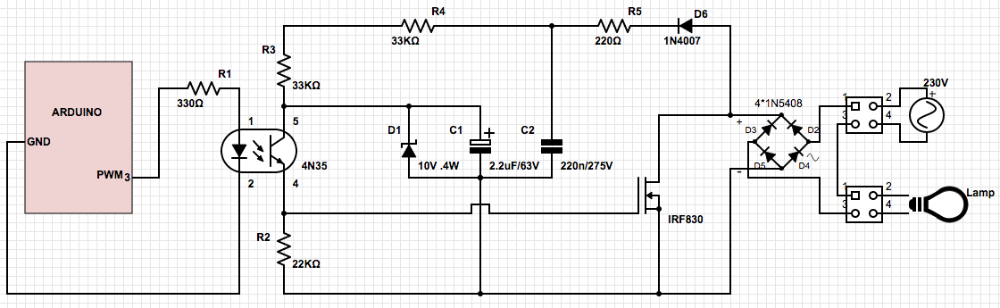

# ePanel IO

## Besoin
- 20 IO au moins
- mettre un Switch ou jumper pour relier les phases et neutres de 2 entrées sorties voisines (pour pouvoir relier ensemble ceux qui viennent du même disjoncteur)

## Notes

- IRF740 -> 10A
- Zc : https://electronics.stackexchange.com/questions/215094/how-to-test-if-zero-crossing-is-working
- Rpi pico: 2 modules with 10 I/O each with io port0 = Zc + power supply
- Rpi pico + esp : jumper pour alim séparée => permet live debug usb + reboot

### Mosfet dimmer schematics
- Prototype1 (does not work) 
- https://electronics.stackexchange.com/questions/557763/trailing-edge-dimmer-circuit-limitations
- https://sound-au.com/project157.htm
- https://electronics.stackexchange.com/questions/277884/problems-with-a-back-to-back-mosfet-dimmer-for-230vac

### 220v current sensor (input)
- https://arduino.stackexchange.com/questions/37044/127v-220v-ac-sensor-whats-the-role-of-this-particular-resistor
- https://smartsolutions4home.com/detecting-mains-voltage-with-microcontroller/
- https://bytesofgigabytes.com/embedded/sensing-ac-voltage-using-microcontroller/

## Notes design ePanel (common with energy monitor)

- i2c bus
- Connexion i2c + power : connecteurs DIN 5 broches + cable ? rj11 ? rj45 ?
- master controler olimex esp32 or rpi1 or rpi2? (peut etre dans le tableau electrique)
- Adresse 7 bits
  - 4bits forts pour type de composants
  - 3bits faibles pour adressage du composant (paramétrable avec jumper si possible)

_ou_

- uart
- esp32 Ethernet + rpi pico sur chaque board
- Switch dans tableau ?
- avantages
  - chaque board est indépendante (Ethernet)
  - uart est bidirectionnel (pas de master/slave)
  - uart messaging semble simple à mettre en œuvre

# Prototype-1

## Observations

- Trous pour borniers trop gros
- Triac:
  - fait clignoter un spot led 10w en OFF
  - fait un leger bruit sur passage de OFF a ON
  - dimming: fait un bourdonnement marqué avec spot 35W (testé à 50/255 et 150/255)
- Mosfet:
  - fait clignoter un spot led 10w en OFF
  - avec resistances 100k en // de la charge, pareil
  - avec spot 35W, R5 brule
