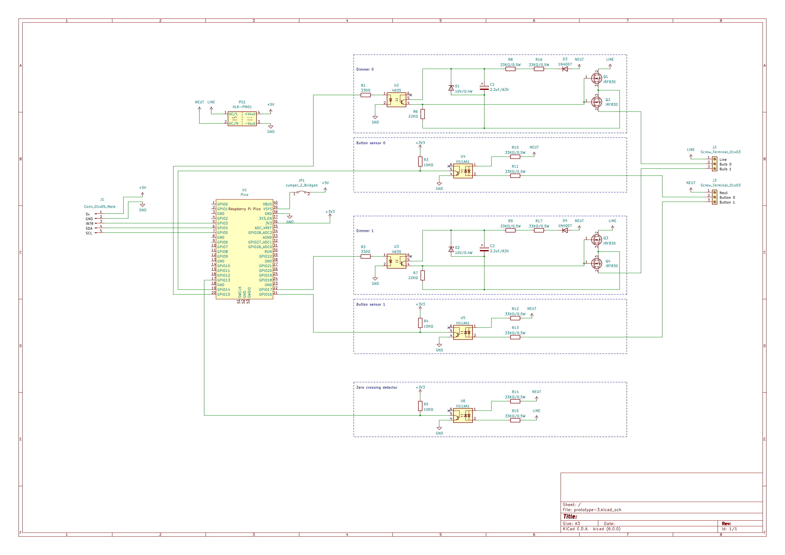

# ePanel IO

## Besoin

- 20 IO au moins
- mettre un Switch ou jumper pour relier les phases et neutres de 2 entrées sorties voisines (pour pouvoir relier ensemble ceux qui viennent du même disjoncteur)

- IO / disjoncteurs:
  - R1: 7 + 3 extension + escalier
  - RDC: 5 + porche
  - Dehors: terrasse (vers spa)

## TODO

- Tester ethernet
- firmware : 2 versions avec 2 adresses
- fabrication 2ieme carte (cf V1/Assemblage boitier)

## Design

- Rpi pico: 2 modules with 10 I/O each with io port0 = Zc + power supply
- Rpi pico + esp : jumper pour alim séparée => permet live debug usb + reboot ?
- Borniers "détachables" ?
- Noter sur le silkscreen a quoi correspondent les borniers/pin headers/jumpers
- Grouper les IO 4 par 4 (1 phase et 1 neutre pour 4 IO) => 4 + 4 + 2 par RPI

---

- Découpage IO:
  - R1: 11     => 4 + 4 + 4
  - RDC: 6     => 4 + 2
  - Dehors: 1  => 2
=> 2x 4+4+2 OK

### ePanel (common with energy monitor)

- i2c bus
- Connexion i2c + power
- master controler olimex esp32 dans le tableau electrique

## V1

### Wiring

### Top

### Bottom

### Images

### Assemblage boitier

- enlever les renforts au milieu a la pince + finition dremel
- raboter les cales pour la carte superieure au dremel
- souder les pin headers
- souder les borniers
- couper a la pince les pins qui depassent des soudures de borniers qui empechent de fermer le boitier correctement

## Prototype-1

### Tests

- Code:
  - https://github.com/vincent-tr/pico-experiments/tree/main/zc
  - https://github.com/vincent-tr/pico-experiments/tree/main/triac
  - https://github.com/vincent-tr/pico-experiments/tree/main/mosfet
- Images:
   
  
  
  

### Observations

- Trous pour borniers trop gros
- Triac:
  - fait clignoter un spot led 10w en OFF
  - fait un leger bruit sur passage de OFF a ON
  - dimming: fait un bourdonnement marqué avec spot 35W (testé à 50/255 et 150/255)
- Mosfet:
  - fait clignoter un spot led 10w en OFF
  - avec resistances 100k en // de la charge, pareil
  - avec spot 35W, R5 brule
  - après avoir changé alim par HLK-PM12, c'est OK!

## Prototype-2

### Tests
- Code:
  - https://github.com/vincent-tr/pico-experiments/tree/main/mosfet
- Images:
   
  
  
  
  

### Observations

- Montage faux : j'ai dessoudé la diode D3 et connecté son anode au neutral
- Anoter les IO (dominos/pin headers) sinon c'est difficile a retrouver après
- La taille du PCB correspond parfaitement au boitier DIN : CNMB/4/kit
- Montage fonctionne avec spot 35w + sport réel salon (mais pas avec spot test 10w, que on/off, non dimmable?)
- Pas de chauffe
- pico "RUN" pin si utilisé sur breadboard doit être relié au VCC, sinon le laisser dangling peut causer des reboot intempestifs

## Prototype-3

### Tests

- Images:
   
  

## Notes

### Mosfet dimmer schematics

- [Prototype1 (does not work)](mosfet-dimmer.png)
- https://electronics.stackexchange.com/questions/557763/trailing-edge-dimmer-circuit-limitations
- https://sound-au.com/project157.htm
- https://electronics.stackexchange.com/questions/277884/problems-with-a-back-to-back-mosfet-dimmer-for-230vac
- IRF740 -> 10A

### 220v current sensor (input)

- https://arduino.stackexchange.com/questions/37044/127v-220v-ac-sensor-whats-the-role-of-this-particular-resistor
- https://smartsolutions4home.com/detecting-mains-voltage-with-microcontroller/
- https://bytesofgigabytes.com/embedded/sensing-ac-voltage-using-microcontroller/
- Zc : https://electronics.stackexchange.com/questions/215094/how-to-test-if-zero-crossing-is-working
