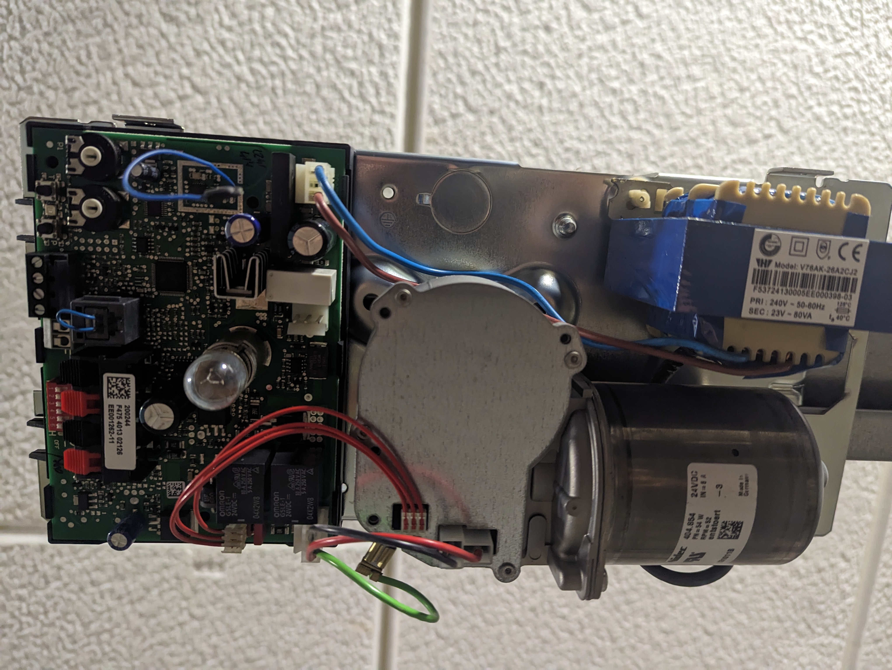
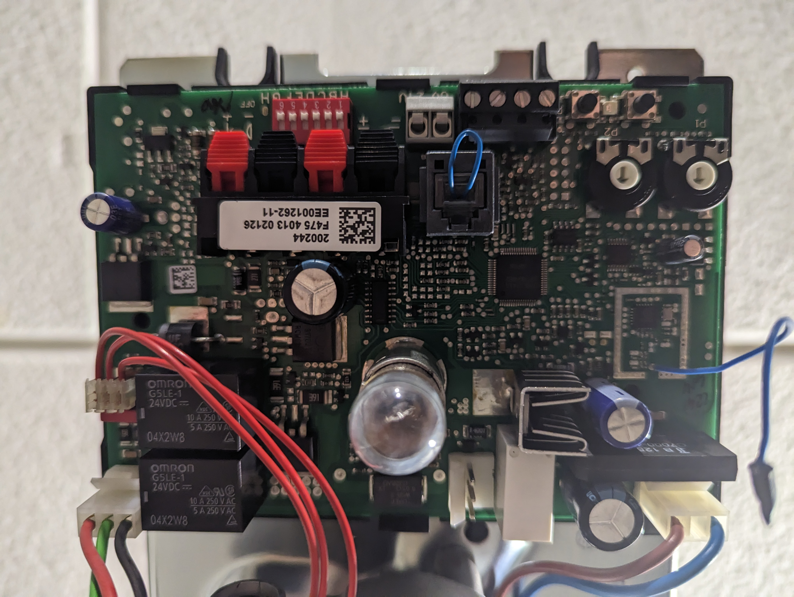
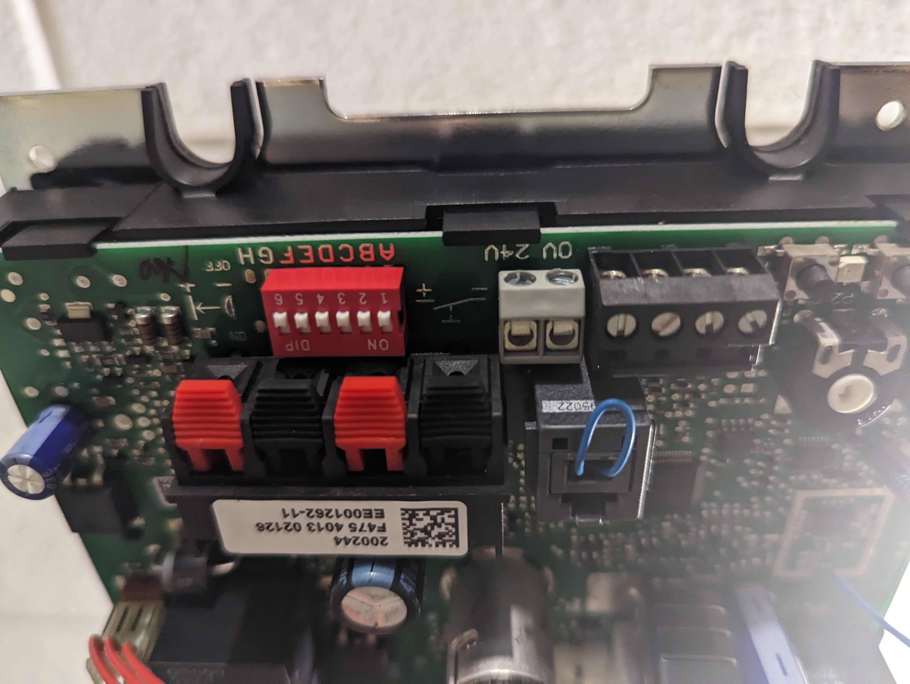

# Garage door driver

## Besoin

- doit tenir dans le boitier de la porte ou a côté avec un cable de commande qui sort du boitier
- Wifi
- alimenté par l'alim de la porte
- le plus de contrôle possible

### Fonctionnement de la porte

- Documentation:
  https://www.tubauto.fr/app/uploads/2018/02/procom7-3-fr.pdf

- Moteur garage:

| | | |
|---|---|---|
||||

- Notes:
  - 4 borniers à gauche (comme matériel HiFi)
    - 2 à gauche : alimentation 13V
    - 2 à droite : poussoir déclencheur externe (24v)
  - 2 borniers noirs
    - Sortie (relais d'option) (24v)
      réglage DIL A=OFF B=ON => fin de course (signal ON si porte fermée, OFF sinon)
  - 4 borniers à droite
    - de gauche à droite : 20 - 21 - 5 - 23
    - 20 commun
    - 21-20 => poussoir ouverture totale (4.8v)
    - 5-20 alimentation 24v
    - 23-20 => poussoir ouverture partielle (4.8v)
  - Alimentation moteur:
    - +24v quand montée
    - -24v quand descente

## Design

## Matériel

## V1

## Notes
