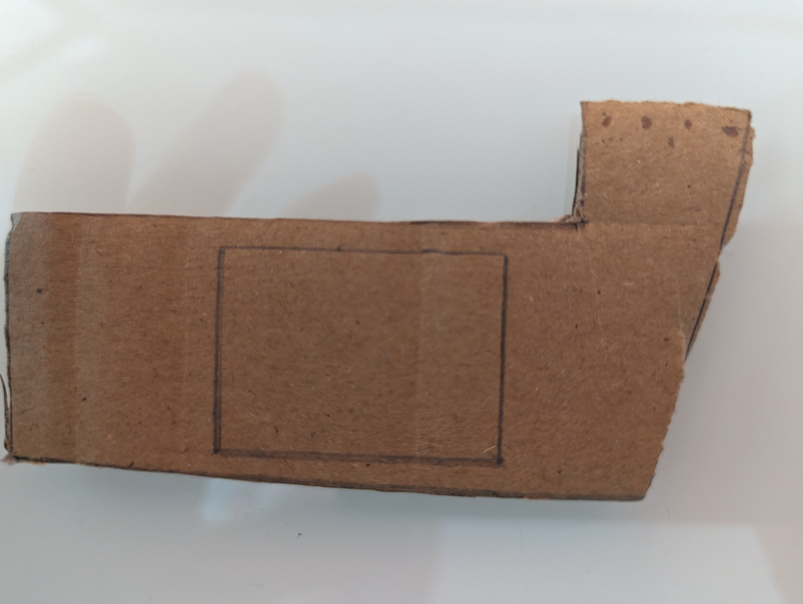
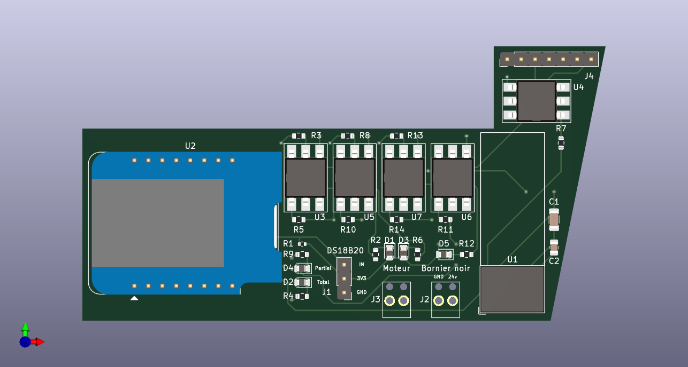
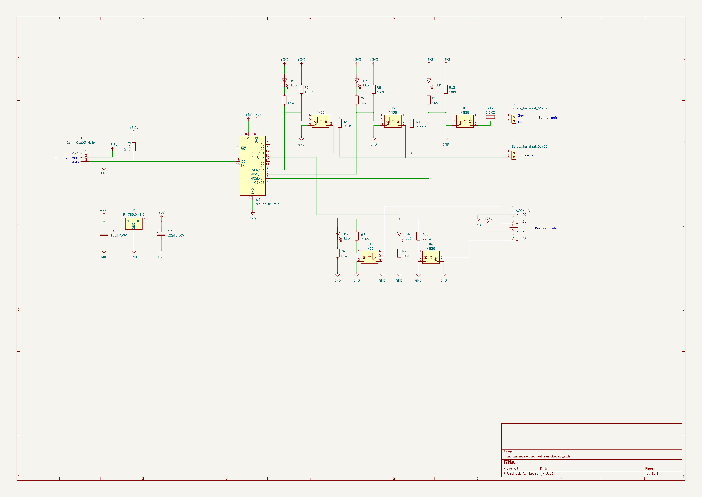

# Garage door driver

## Besoin

- doit tenir dans le boitier de la porte ou a côté avec un cable de commande qui sort du boitier
- Wifi
- alimenté par l'alim de la porte
- le plus de contrôle possible
- ajouter un capteur de température

### Fonctionnement de la porte

- Documentation:
  https://www.tubauto.fr/app/uploads/2018/02/procom7-3-fr.pdf

- Moteur garage:

| | | |
|---|---|---|
||||
||||

- Notes:
  - 4 borniers à gauche (comme matériel HiFi)
    - 2 à gauche : alimentation 13V
    - 2 à droite : poussoir déclencheur externe (24v)
  - 2 borniers noirs
    - Sortie (relais d'option) (24v)
      réglage DIL A=OFF B=ON => fin de course (signal ON si porte fermée, OFF sinon)
  - 4 borniers à droite
    - de gauche à droite : 20 - 21 - 5 - 23
    - 20 commun
    - 21-20 => poussoir ouverture totale (4.8v)
    - 5-20 alimentation 24v
    - 23-20 => poussoir ouverture partielle (4.8v)
  - Alimentation moteur:
    - +24v quand montée
    - -24v quand descente

## Design

- Board
  - Wemos D1 mini (ESP8266) 
  - https://amzn.eu/d/irlLEVS
- Alim
  - connexion au 24v
  - https://fr.rs-online.com/web/p/regulateurs-a-decoupage/1934004
  - regarder datasheet pour condensateurs à rajouter
- Borniers
  - https://fr.rs-online.com/web/p/borniers-pour-circuits-imprimes/7901098
- outputs x2 (ouverture partielle/totale)
  - 4.8v vers un commun qui semble etre GND, semble parfait pour sortie transistor
  - 4n35 (1.3v 10ma) https://fr.farnell.com/vishay/4n35/optocoupleur-phototransistor-5000vrms/dp/1328375
  - GPIO 3.3v => R=220ohm
- inputs x3 (moteur double sens, relais d'option)
  - 24v
  - 4n35 (1.3v 10ma) https://fr.farnell.com/vishay/4n35/optocoupleur-phototransistor-5000vrms/dp/1328375
  - 24v => R=2.2kohm
- fixation/layout PCB
  - PCB avec pin header (1 pin sur 2 pour pas de 5.08)
  - les pins headers sont serrés dans les 4 borniers à droite
  - prévoir borniers + fils pour les 2 borniers du milieu
  - taille
    - pin headers vers bord 2.54mm
    - pin headers vers dégagement 1.5cm
    - bord droit retrait degradé sur 1 cm
    - Épaisseur PCB ok des 2 côtés (hauteur/profondeur)
    - H totale = 5cm
    - L totale = 9.5cm

## V1

### Wiring

- GPIO14 - D5 : in moteur (active low)
- GPIO12 - D6 : in moteur (active low)
- GPIO13 - D7 : in porte fermée (active low)
- GPIO4 - D2 : out ouverture partielle
- GPIO5 - D1 : out ouverture totale
- GPIO3 - RX : DS18B20

### 3D view

### Main

## Notes

commande : 
2 borniers petits
alim