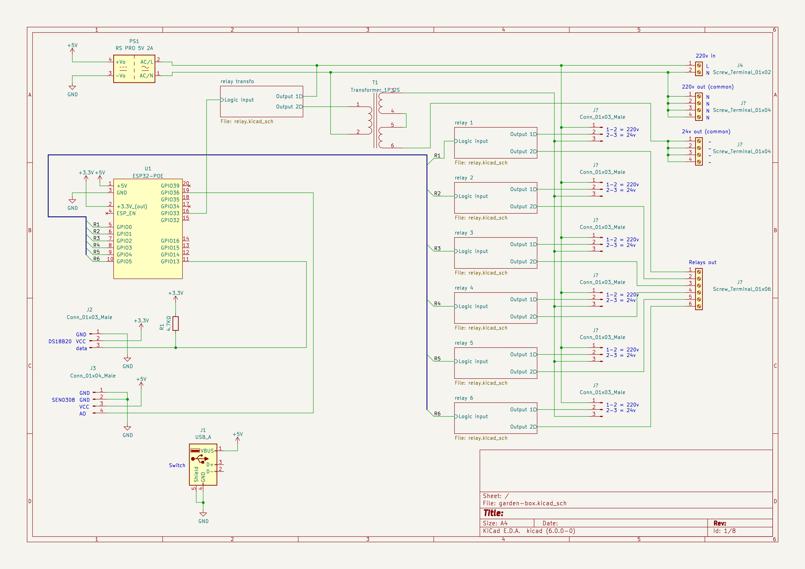
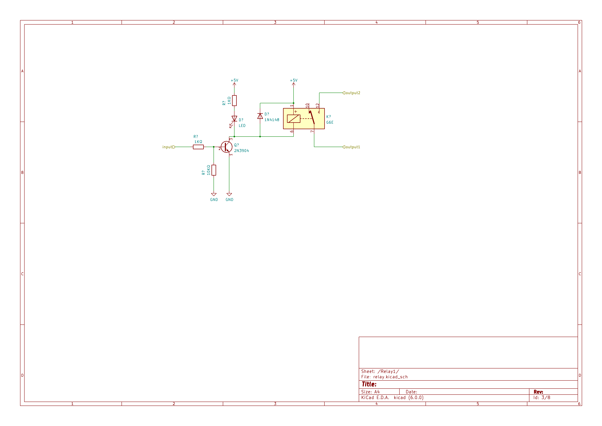

# Garden box

## Besoin

- capteur températeur
- capteur humidité sol
- drivers électrovannes
- drivers RGB 24v
- driver lanterne/guirlande

## Design

### generic

- 1 place pour un switch
- esp32 poe
- convertisseur 12v -> 5v
- 1 transfo 24v AC pour electrovannes (capable d'alimenter 3 ou 4 electrovannes), avec un relais
- 6 sorties relais, switchable (par jumper) entre 220v et 24v
- led en face de chaque relais (sortie + transfo 24v)
- ds 18b20
- capteur humidité sol avec ADC

#### Materiel

- boitier :
  - https://fr.rs-online.com/web/p/boitiers-pour-usage-general/2010161
- switch :
  - DLink GO-SW-5E
  - https://eu.dlink.com/fr/fr/products/go-sw-5e
  - dimensions : 87 x 47.85 x 21.7mm
  - alimentation : 5V 0.55A
- capteur humidité sol :
  - https://fr.rs-online.com/web/p/kits-de-developpement-pour-capteur/2049905
- relais : 
  - Omron G6DN-1A-L DC5
  - https://fr.rs-online.com/web/p/relais-de-puissance/2051958 (En stock à partir du 27/03/2023)
  - https://fr.farnell.com/omron/g6dn-1a-l-dc5/relais-puissance-spst-no-5a-250v/dp/2831773
- convertisseur 12v -> 5v : (En stock à partir du 14/02/2023)
  - https://fr.rs-online.com/web/p/regulateurs-a-decoupage/1934032
  - Courant de sortie : 2A
  - regarder la datasheet il faut mettre des condensateurs avec
- Transfo :
  - https://fr.rs-online.com/web/p/transformateurs-pour-circuits-imprimes/3472846
  - dimensions : 77.5 x 60 x 48.5
  - Puissance : 36VA

### led driver

_TODO_

## V1

### Main

### Relay

## Notes

- Bus avec 230v, 12v ondulé, ethernet
- Boite avec couvercle transparent
- Presses etoupe
- Electrovannes : Solénoïde robuste : 24 V c.a., courant d'appel de 370 mA, courant de maintien de 190 mA, 60 cycles ; courant d'appel de 475 mA, courant de maintien de 230 mA, 50 cycles
- RS online has symbol library, convertible to kicad
- schema pilotage relais : https://i.stack.imgur.com/04BfF.jpg
- Boitier actuel IP 55 210x170x70, dimenesions intérieures 204x164x75 https://www.leroymerlin.fr/produits/electricite-domotique/rallonge-multiprise-enrouleur-et-cable-electrique/accessoires-de-connexion-boite-de-derivation/boite-de-derivation/boite-de-derivation-etanche-en-saillie-debflex-10-entrees-65104445.html
  
