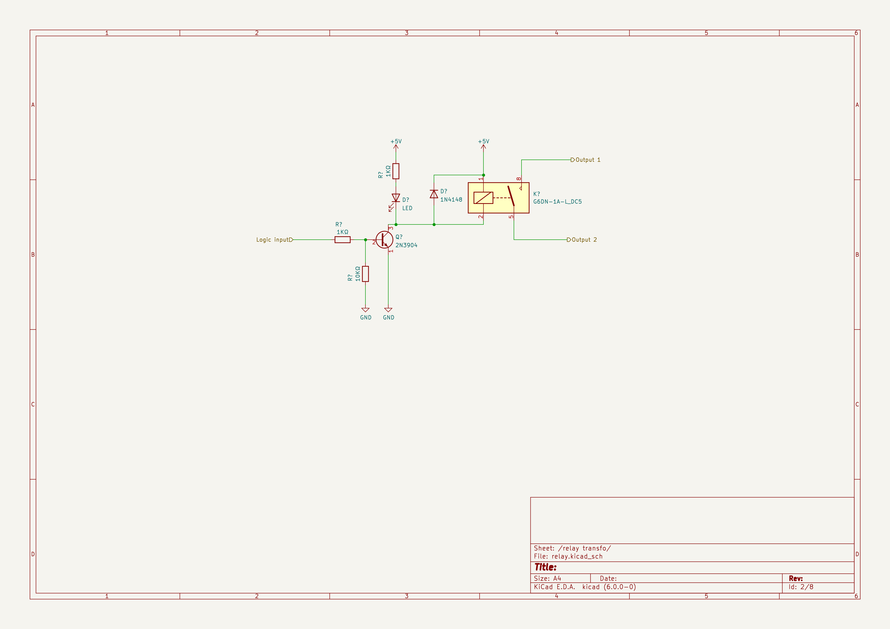

# Garden box

## Besoin

- capteur températeur
- capteur humidité sol
- drivers électrovannes
- drivers RGB 24v
- driver lanterne/guirlande

## Design

### generic

- 1 place pour un switch
- esp32 poe
- convertisseur 12v -> 5v
- 1 transfo 24v AC pour electrovannes (capable d'alimenter 3 ou 4 electrovannes), avec un relais
- 6 sorties relais, switchable (par jumper) entre 220v et 24v
  - led en face de chaque relais (sortie + transfo 24v)
  - mettre un seul jumper pour choisir entre 220v et 24v
  - chaque relais a une seule sortie
  - mettre 6 screwterminals common 220v et 6 screwterminals common 24v. Cela permet de mettre qu'un seul cable common vers les electrovannes (eg: pouvoir piloter 3 electrovannes avec un cable 4 cores plutot que 6 cores)
- ds 18b20
- capteur humidité sol avec ADC

#### Materiel

- boitier :
  - https://fr.rs-online.com/web/p/boitiers-pour-usage-general/2010161
  - fixation : https://fr.rs-online.com/web/p/vis-autotaraudeuses/4831224
- switch :
  - DLink GO-SW-5E
  - https://eu.dlink.com/fr/fr/products/go-sw-5e
  - dimensions : 87 x 47.85 x 21.7mm
  - alimentation : 5V 0.55A, Jack 5.5 2.5, avec + au centre
  - Connecteur USB 
    - cable : https://fr.rs-online.com/web/p/connecteurs-usb/8006797
    - ~~connecteur : https://fr.rs-online.com/web/p/connecteurs-usb/8006797~~
    - connecteur : https://fr.rs-online.com/web/p/connecteurs-usb/7710057
- capteur humidité sol :
  - https://fr.rs-online.com/web/p/kits-de-developpement-pour-capteur/2049905
- relais : 
  - Omron G6DN-1A-L DC5
  - courant de bobine : 22ma
  - https://fr.rs-online.com/web/p/relais-de-puissance/2051958 (En stock à partir du 27/03/2023)
  - https://fr.farnell.com/omron/g6dn-1a-l-dc5/relais-puissance-spst-no-5a-250v/dp/2831773
- convertisseur 12v -> 5v : (En stock à partir du 14/02/2023)
  - https://fr.rs-online.com/web/p/regulateurs-a-decoupage/1934032
  - Courant de sortie : 2A
  - regarder la datasheet il faut mettre des condensateurs avec  
_- OU -_
- alim 220v
  - alim 220v -> 5V 2A : https://fr.rs-online.com/web/p/alimentations-a-decoupage/1812115
- Transfo :
  - https://fr.rs-online.com/web/p/transformateurs-pour-circuits-imprimes/3472818 (moins cher)
  - ~~https://fr.rs-online.com/web/p/transformateurs-pour-circuits-imprimes/7320506~~
  - ~~https://fr.rs-online.com/web/p/transformateurs-pour-circuits-imprimes/3472846~~
  - dimensions : 77.5 x 60 x 48.5
  - Puissance : 36VA

### led driver

_TODO_

## Proto 1

### Objectifs

- valider implantation du PCB dans boitier
- tester capteur humidité
- tester montage transistor/relais
- tester implantation alim sur PCB
- tester implantation transfo sur PCB
- tester ds18b20
- tester end-to-end que solenoide fonctionne avec relais/transfo
- trouver meilleure solution (jack? bornier?) pour alim switch

### Tests

- GPIO35 => inutilisable pour DS18B20 (impossible de mettre en output), utiliser eg GPIO13 à la place
- Circuit relais:
  - mauvais footprint SOT23-3 du transistor, pin 1 et 2 sont inversés
  - si on court-circuite collector/emitter du transistor ca fonctionne.
- DS18b20: OK
- SEN0308
  - sec : 2.95V
  - dans l'eau : 0.28V

### Observations

OK:
- implantation PCB dans boitier
- implantation alim sur PCB
- implantation relais sur PCB

KO: 
- vis PCB boitiers -> semble être presque bon dimaètre, mais tourne dans le vide
- implantation transfo sur PCB
- implantation prise USB sur PCB

A améliorer:
- silkscreen pinout DS18B20
- silkscreen pinout SEN0308
- silkscreen pinout alim + relais (phase/neutre)
- implantation switch:
  - mettre en travers, a gauche, voyants vers le haut (pour position alim)
  - a 5cm du bord cote lumieres
  - centrer l'alim dessous, on fixera le switch sur l'alim (ca sureleve le switch)
  - si beosin on peut mettre ESP32 entre le switch et le bord cote voyants (vu qu il est surelevé ca ne gene pas, par contre eviter l'autre cote a cause de la place des cables ethernet), mettre cote ethernet a droite vers le milieu
  - mettre prise usb coté cables ethernet car pas besoin d'etre accessible et peu fragile

## Proto 2

### Objectifs

- tester montage transistor/relais
- tester organisation PCB (ali, switch sur alim, esp, connectique, ...)
- tester implantation transfo sur PCB
- tester end-to-end que solenoide fonctionne avec relais/transfo
- tester connecteur USB alim switch

### TODO

- OK changer GPIO ds18b20 (35 -> 13)
- OK mauvais footprint Q1
- vis PCB boitiers
- OK implantation transfo sur PCB
- OK implantation prise USB sur PCB
- OK silkscreen pinout DS18B20
- OK silkscreen pinout SEN0308
- OK silkscreen pinout alim + relais (phase/neutre)
- OK implantation switch

## V1

### Main

_Manque resistance sur ds18b20_

_Refaire alim_

### Relay

## Notes

- Bus avec 230v, (12v ondulé), ethernet
- Boite avec couvercle transparent
- Presses etoupe
- Electrovannes : Solénoïde robuste : 24 V c.a., courant d'appel de 370 mA, courant de maintien de 190 mA, 60 cycles ; courant d'appel de 475 mA, courant de maintien de 230 mA, 50 cycles
- RS online has symbol library, convertible to kicad
- schema pilotage relais : https://i.stack.imgur.com/04BfF.jpg
- Boitier actuel IP 55 210x170x70, dimenesions intérieures 204x164x75 https://www.leroymerlin.fr/produits/electricite-domotique/rallonge-multiprise-enrouleur-et-cable-electrique/accessoires-de-connexion-boite-de-derivation/boite-de-derivation/boite-de-derivation-etanche-en-saillie-debflex-10-entrees-65104445.html
  
