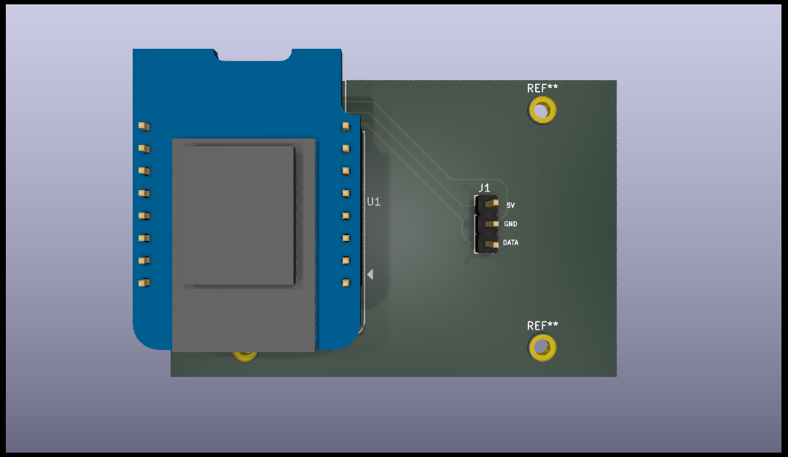
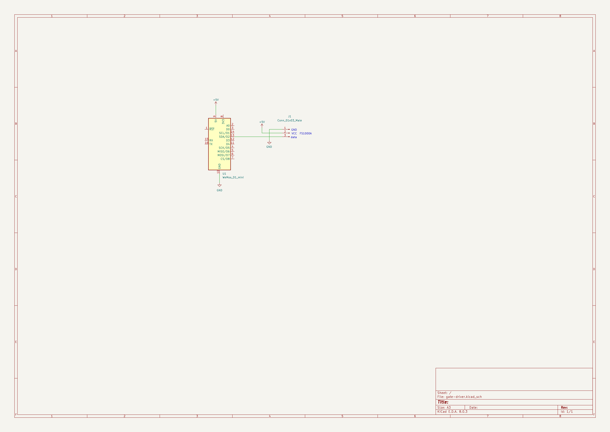

# Gate driver

## Besoin

- piloter le portail
- le plus de contrôle possible
- boitier separé dans garage à côté deu moteur de porte

## Design

- Carte avec WeMos D1 mini, fs1000a et boîtier comme clim

## Material

- boitier :
  - https://fr.rs-online.com/web/p/boitiers-pour-usage-general/9190373
  - pas de vis : https://www.amazon.fr/gp/product/B088QJG676
  - vis : https://fr.rs-online.com/web/p/vis-a-metaux/9141462
- Wemos D1 mini :
  - https://www.amazon.fr/dp/B093G72SHN
- Emetteur :
  - FS100A
  - Oscillateur 433.42MHz
  - changer l'oscillateur : https://github.com/Nickduino/Pi-Somfy
  

## V1

### 3D view

### Main

## Notes

- https://github.com/rstrouse/ESPSomfy-RTS
- https://pushstack.wordpress.com/somfy-rts-protocol/
- https://github.com/dmslabsbr/esphome-somfy
- https://github.com/Nickduino/Pi-Somfy
- https://github.com/loopj/open-rts
- https://github.com/nicerloop/esphome-somfy-rts
- https://github.com/Legion2/Somfy_Remote_Lib
- appairage: https://forum.eedomus.com/viewtopic.php?f=14&t=2058
- rfxcom : http://www.rfxcom.com/epages/78165469.mobile/en_GB/?ObjectPath=/Shops/78165469/Products/14103&Locale=en_GB
