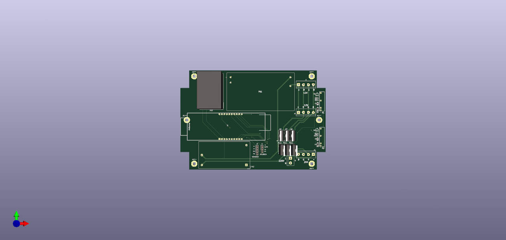
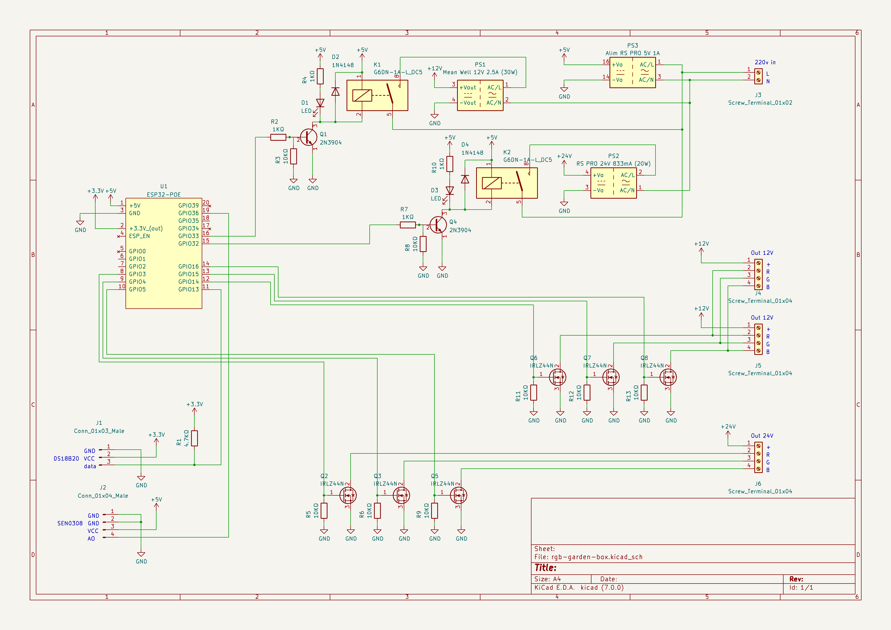
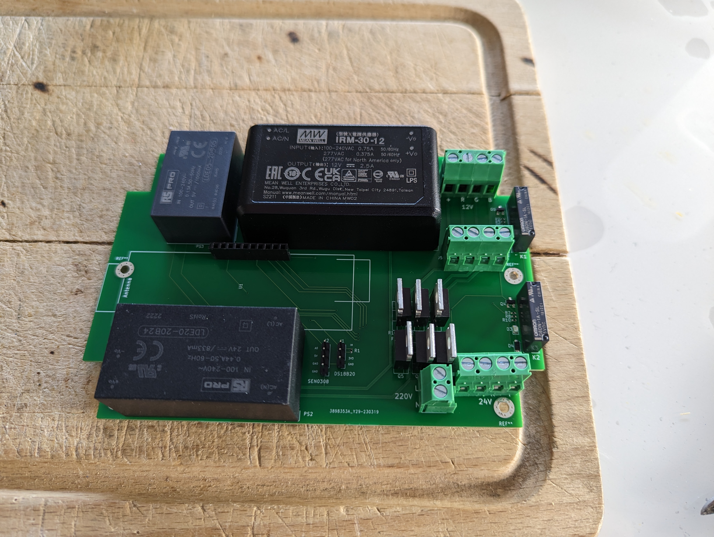

# RGB garden box

## Besoin

- 4 spots 24V 0.6W IDTOLight Monte Carlo LO681004ABX
  - pinout : + Black commun
- 2 spots 12V 10W
  - common +
- étanche
- ethernet
- tient dans regard 19x19x19

## Design

- esp32 poe
- petite alim pour ESP
- grosse alim + relais pour spots
- Mosfets:
  - IRLZ44N D2PAK
  - IRLZ44N TO220 https://fr.farnell.com/webapp/wcs/stores/servlet/ProductDisplay?catalogId=15001&productSeoURL=infineon&partNumber=8651418&storeId=10160
  - résistance de 10k - 100k entre commande et gnd, évite que ça flotte
- spot 12V 10W:
   - [RGB spot 10W](../rgb-spot-10w/README.md)

## Matériel

- Boîtier : https://fr.rs-online.com/web/p/boitiers-pour-usage-general/2010158
- Alims :
  - 5V/1A - 37x24.5x18 : https://fr.rs-online.com/web/p/alimentations-a-decoupage/1812200
  - 12V/30W - 69.5x39x24 : https://fr.rs-online.com/web/p/alimentations-a-decoupage/1358946
  - 24V/20W - 53.8x28.8x23.5 : https://fr.rs-online.com/web/p/alimentations-a-decoupage/1812126
- Borniers : https://fr.rs-online.com/web/p/borniers-pour-circuits-imprimes/1444286
- Relais : Omron G6DN-1A-SL DC5 (general usage) - https://fr.rs-online.com/web/p/relais-de-puissance/2436601 

## V1

### Wiring
### 3D view

### Main

### Images

## Notes
