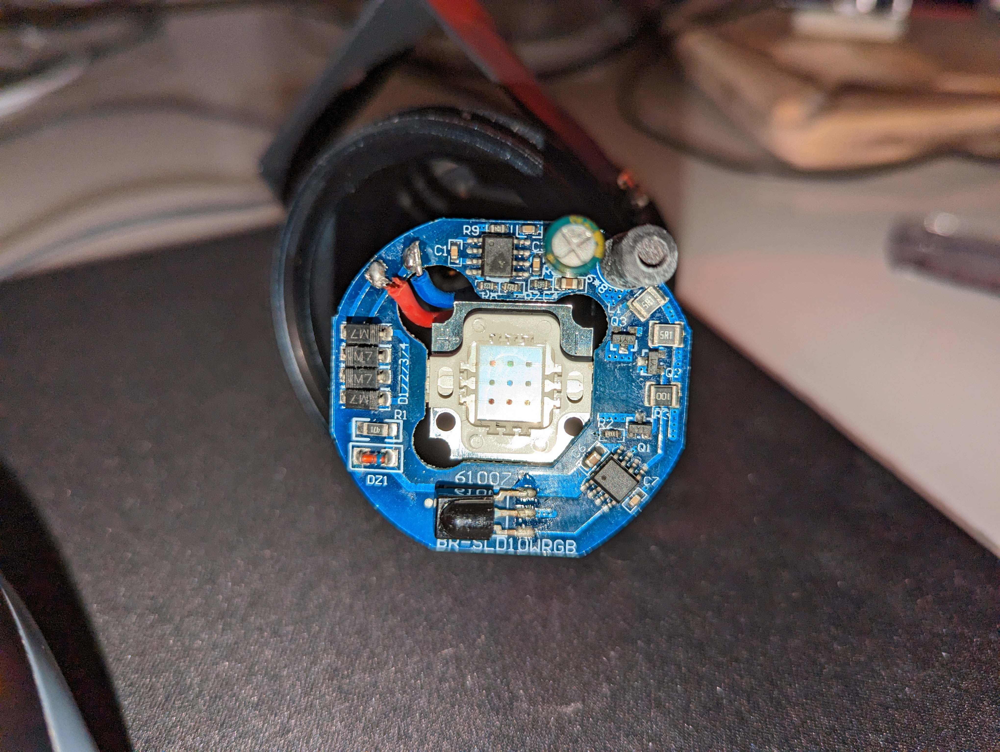
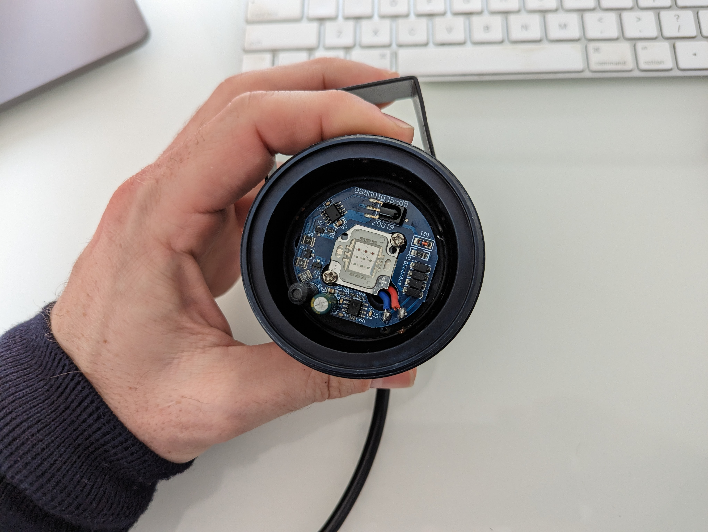
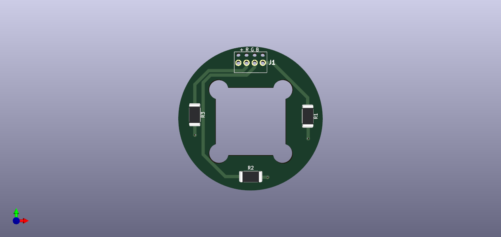
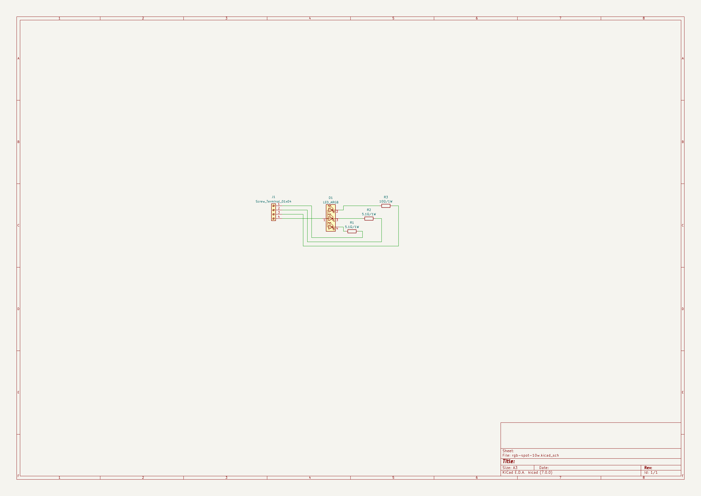
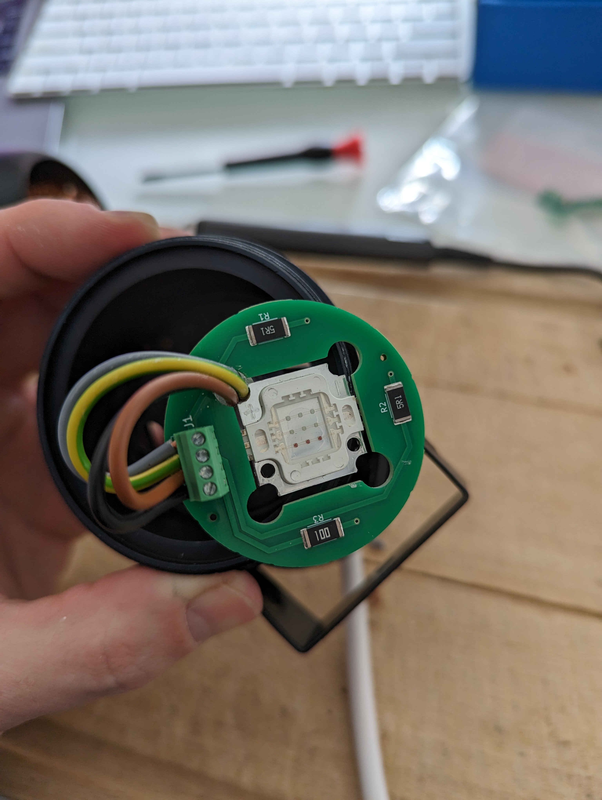
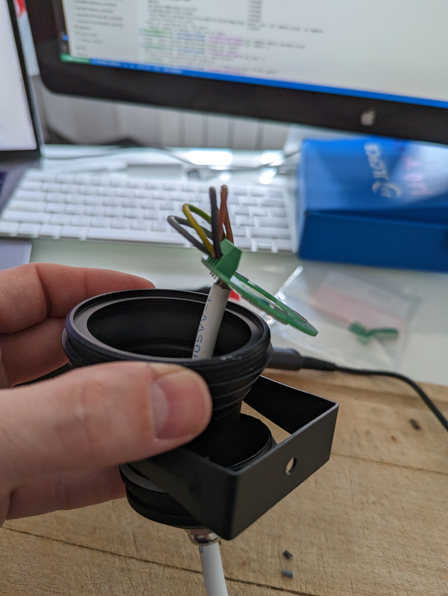

new-in# RGB spot 10W

## Besoin

PCB pour remplacer le design IR existant:
- qui tient dans le spot
- soudé a la led RGB 10W
- connecter les cables dessus
- 2 spots outside + 1 inside existant (on peut prevoir au moins 5 pieces)

## Design

- Resistances:
  - Red: 10Ω 1W
  - Green, Blue: 5.1Ω 1W
- TODO:
  - tester passage cable
  - dessouder led
  - design pour embarquer, avec si possible bornier (voir si on a assez de place dessous pour les pins, et dessus) sinon souder directement les cables dessus
    - Footprint https://forum.fritzing.org/t/power-led-10w-rgb/6441
    - PCB 4.5 cm diametre
    - largeur entre pins : 2.1cm (carré)
    - +3 mm aux coins our passage vis
    - agrandir un coin pour passage cables
    - design IR: 
      
      

## Matériel

- Resistances:
  - Red: 10Ω => https://jlcpcb.com/partdetail/Yageo-RC2512JK0710RL/C137014
  - Green, Blue: 5.1Ω => https://jlcpcb.com/partdetail/Koa_SpeerElec-RK73BW3ATTE5R1J/C514891
- Bornier:
  - https://fr.rs-online.com/web/p/borniers-pour-circuits-imprimes/7901102

## V1

### 3D view

### Main

### Images

## Notes
